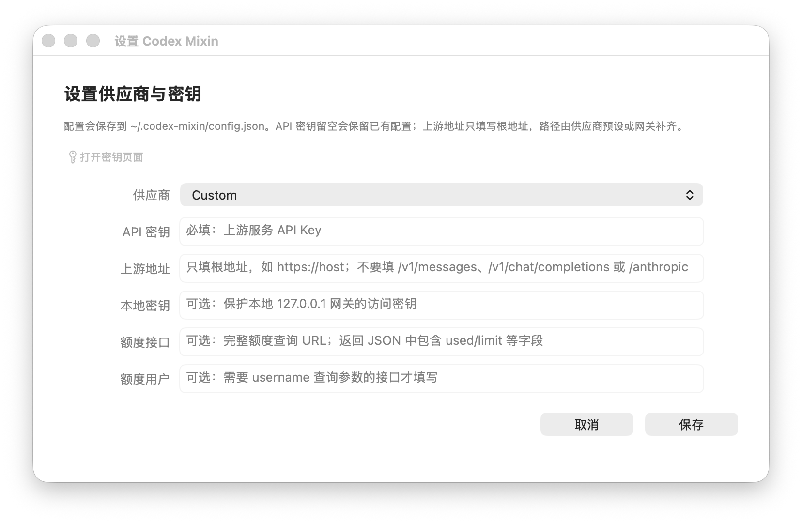

# Codex Mixin


Codex Mixin 是一个 macOS 菜单栏应用和本地 Rust 网关，用来在保留 Codex 官方 ChatGPT/OpenAI 账号能力的同时，把 OpenRouter、DeepSeek、Baidu OneAPI 或其他自定义模型接入 Codex。

核心目标很明确：官方 GPT 模型继续走 Codex 官方认证和远程控制路径，自定义模型通过本地网关进入同一个 Codex 模型选择器。



## 能解决什么

- 不替换 Codex 官方账号路径：官方 GPT 模型保留原名，继续使用 Codex 官方认证。
- 不覆盖历史会话：安装时保留当前 Codex provider，只把该 provider 的地址指向本地网关，避免切换 provider 后会话看起来消失。
- 不直接污染配置：安装前备份 `~/.codex/config.toml`，卸载时恢复备份并移除托管模型目录。
- 不要求上游返回完整 metadata：模型上下文、能力和 instruction 字段会结合 LiteLLM metadata 与内置正则规则补齐。
- 不只支持单一 API：内置 Baidu OneAPI、OpenRouter、DeepSeek，也支持通用 Anthropic Messages 和 OpenAI Chat Completions 上游。

## 快速开始

构建菜单栏 app：

```bash
./macos/build_app.sh
open "dist/Codex Mixin.app"
```

或者只使用 CLI：

```bash
cargo build --release
./target/release/codex-mixin login --provider openrouter --key sk-...
./target/release/codex-mixin doctor
./target/release/codex-mixin install-codex --codex-oauth-proxy
./target/release/codex-mixin start --daemon
```

菜单栏 app 会把私有配置写到：

```text
~/.codex-mixin/config.json
```

本地服务默认监听：

```text
http://127.0.0.1:8787/v1
```

launchd 服务名：

```text
local.codex-mixin.service
```

## 供应商预设

| 供应商 | 上游协议 | 默认上游地址 | 生成接口 | 模型接口 | 额度接口 |
| --- | --- | --- | --- | --- | --- |
| `custom` | Anthropic Messages 默认 | 用户填写 | `/v1/messages` | `/v1/models` | 无 |
| `baidu-oneapi` | Anthropic Messages | `https://oneapi-comate.baidu-int.com` | `/v1/messages` | `/v1/models` | `/openapi/v3/user/quota` |
| `openrouter` | OpenAI Chat Completions | `https://openrouter.ai/api` | `/v1/chat/completions` | `/v1/models` | `/v1/credits` |
| `deepseek` | OpenAI Chat Completions | `https://api.deepseek.com` | `/chat/completions` | `/models` | 无 |

设置窗口里的上游地址只填根地址，不要填 `/v1/messages`、`/v1/chat/completions` 或 `/anthropic`。路径由供应商预设或网关补齐。

## 安装到 Codex 的行为

推荐安装方式：

```bash
./target/release/codex-mixin install-codex --codex-oauth-proxy
```

安装会做四件事：

1. 读取上游 `/models`，生成 Codex 可用的模型目录。
2. 写入独立模型目录文件 `~/.codex/model-catalogs/mixin-models.json`。
3. 备份当前 `~/.codex/config.toml`，再写入托管配置。
4. 保留现有默认 provider，只更新该 provider 的 `base_url` 和 OAuth 能力字段。

托管配置的关键形态：

```toml
model_catalog_json = "/Users/you/.codex/model-catalogs/mixin-models.json"

[model_providers.openai]
name = "OpenAI"
base_url = "http://127.0.0.1:8787/v1"
wire_api = "responses"
requires_openai_auth = true
supports_websockets = true
```

如果原配置里已经有 `model_provider`，Codex Mixin 会更新那个 provider；如果没有显式 `model_provider`，按 Codex 默认的 `openai` provider 处理。

路由规则：

- Codex 官方目录里的 `gpt-*` 模型保留原名，继续走官方 Codex/OpenAI 后端。
- 自定义上游返回的 `gpt-*` 模型会安装为 `gpt-...-custom`，避免顶掉官方 GPT。
- 其他自定义模型保留上游模型 ID，通过本地网关转发。

安装或卸载后需要重启 Codex App。Codex CLI 需要开新会话。

卸载恢复：

```bash
./target/release/codex-mixin uninstall-codex
```

## 菜单栏功能

菜单栏 app 提供这些动作：

- `启动本地网关`：写入并加载用户级 launchd agent。
- `暂停本地网关`：卸载 launchd agent，并停止当前 daemon。
- `重启本地网关`：重新写入 launchd agent 并启动服务。
- `刷新状态与额度`：刷新服务状态和额度进度条。
- `设置供应商与密钥...`：选择供应商、填写 API Key、上游根地址、本地保护密钥和额度接口。
- `安装到 Codex...`：生成模型目录，写入托管 Codex 配置。
- `从 Codex 恢复...`：恢复安装前备份，删除托管模型目录。
- `复制本地接口地址`：复制 `http://127.0.0.1:8787/v1`。
- `打开运行日志`：打开 `~/.codex-mixin/gateway.log`。
- `打开配置目录`：打开 `~/.codex-mixin`。

服务由 launchd 托管，关闭终端或退出菜单栏 app 后仍会继续运行。需要停服务时使用菜单里的暂停动作。

## CLI 命令

```bash
codex-mixin login
codex-mixin logout
codex-mixin doctor
codex-mixin status
codex-mixin models --json
codex-mixin quota --json
codex-mixin config --json
codex-mixin start --daemon
codex-mixin stop
codex-mixin restart
codex-mixin logs -n 200
codex-mixin catalog
codex-mixin refresh-metadata
codex-mixin install-codex --codex-oauth-proxy
codex-mixin uninstall-codex
codex-mixin migrate-history
```

`serve` 仍保留为前台 `start` 的兼容别名，但新文档和菜单栏 app 统一使用 `start`。

## 模型上下文和 metadata

很多自定义 `/models` 接口只返回模型 ID。Codex Mixin 生成模型目录时会按以下顺序补齐上下文窗口和能力字段：

1. `CODEX_GATEWAY_MODEL_METADATA` 指向的本地 metadata 文件。
2. `~/.codex-mixin/model_metadata_litellm.json`，由 `refresh-metadata` 或安装时自动拉取 LiteLLM metadata 生成。
3. 内置模型族正则规则，例如 Claude、DeepSeek、GPT、Kimi、GLM、MiniMax 等常见命名。

生成的 catalog 会包含 `context_window`、`max_context_window`、`input_modalities`、`base_instructions` 和 `model_messages.instructions_template`，避免 Codex 解析模型目录时报缺字段。

## Thinking 与 Web Search

Anthropic 风格上游支持 Codex reasoning effort 到 thinking 的映射：

| Codex effort | Anthropic thinking |
| --- | --- |
| `minimal` / `low` | `low` |
| `medium` | `medium` |
| `high` | `high` |
| `xhigh` / `exhigh` / `max` | `max` |

未知 effort 会返回 400，而不是静默降级到错误档位。

Web search 转发默认关闭，需要显式开启：

```bash
CODEX_GATEWAY_ENABLE_WEB_SEARCH_TOOL=true
CODEX_GATEWAY_WEB_SEARCH_TOOL_TYPE=web_search_20250305
CODEX_GATEWAY_WEB_SEARCH_MAX_USES=3
```

## 开发与验证

```bash
cargo test
./macos/build_app.sh
```

## Release 产物

GitHub Actions 在推送 `v*` tag 或手动运行 Release workflow 时生成四组平台产物：

| 平台 | 架构 | CLI 包 | 安装包 |
| --- | --- | --- | --- |
| Linux | `x86_64` | `.tar.gz` | `.deb` |
| Linux | `aarch64` | `.tar.gz` | `.deb` |
| macOS | `x86_64` | `.tar.gz` | `.dmg` |
| macOS | `aarch64` | `.tar.gz` | `.dmg` |

macOS 的 `.dmg` 内包含 `Codex Mixin.app`、`bin/codex-mixin` 和 `Applications` 快捷入口。Linux 的 `.deb` 会把 CLI 安装到 `/usr/local/bin/codex-mixin`。

做 Codex 配置实验时不要直接碰真实配置，使用隔离目录：

```bash
CODEX_HOME=/tmp/codex-mixin-home ./target/release/codex-mixin install-codex --codex-oauth-proxy
```

## 相关文档

- [产品宣传文档](docs/promo.md)
