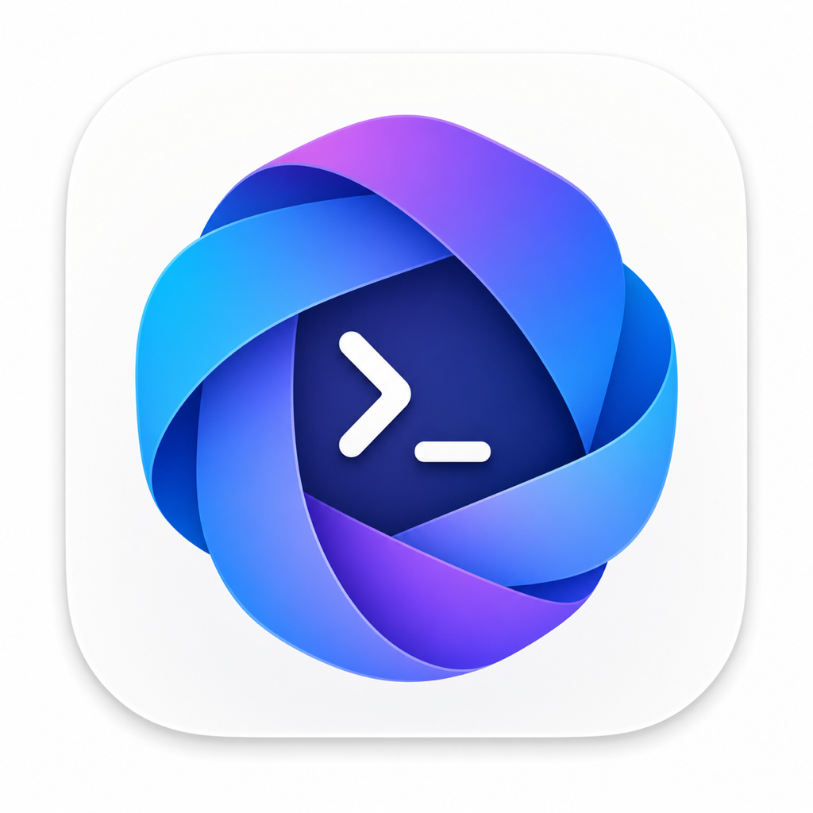
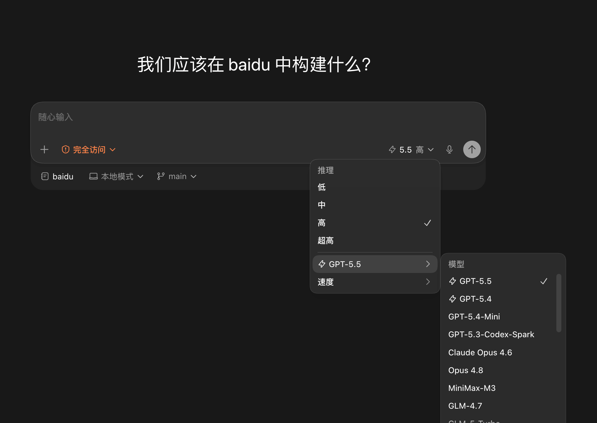
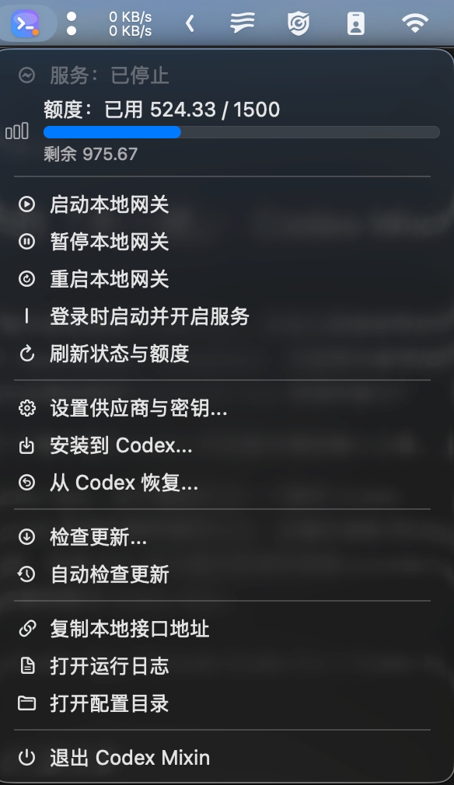
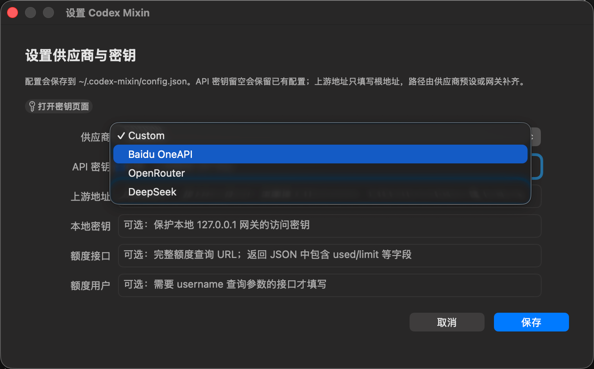
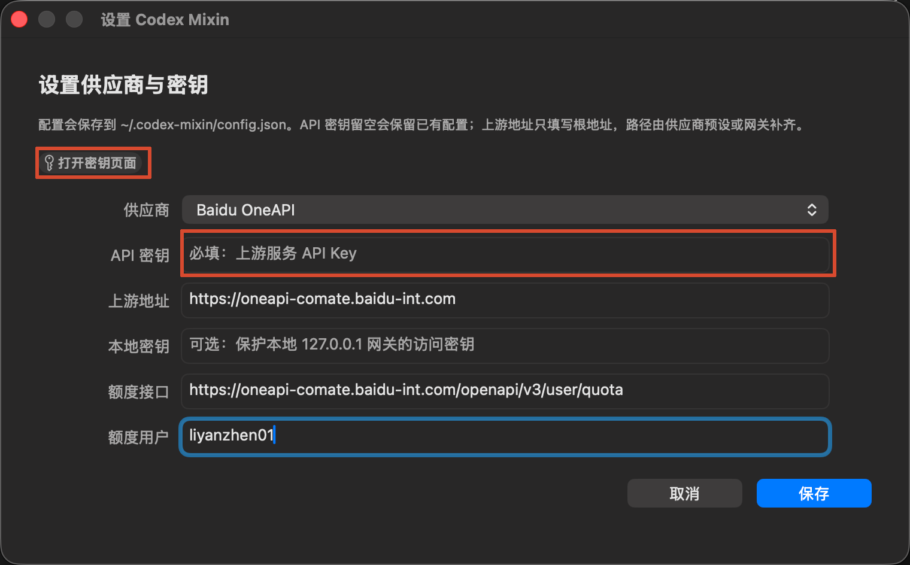

# Codex Mixin

<p align="center">
  
</p>

<p align="center">
  <a href="https://github.com/Edward-lyz/codex-mixin/actions/workflows/ci.yml"></a>
  <a href="https://github.com/Edward-lyz/codex-mixin/releases/latest"></a>
  <a href="https://github.com/Edward-lyz/codex-mixin/releases"></a>
  <a href="LICENSE"></a>
  
</p>

<p align="center">
  <b>Bring custom model providers into official Codex without giving up ChatGPT account features.</b>
</p>

<p align="center">
  <a href="#中文">中文</a> ·
  <a href="#english">English</a> ·
  <a href="https://github.com/Edward-lyz/codex-mixin/releases/latest">Download</a> ·
  <a href="https://github.com/Edward-lyz/codex-mixin/issues">Issues</a>
</p>



## 中文

Codex Mixin 是一个 Rust 本地网关、CLI 和 macOS 菜单栏 App。它把 OpenRouter、DeepSeek、Baidu OneAPI 或其他 OpenAI Chat Completions / Anthropic Messages 兼容模型接入官方 Codex，同时保留官方 ChatGPT/OpenAI 账号路径、官方 GPT 模型、远程控制和 Codex 原生体验。

它不是 Codex 的二次发行版，也不重新打包官方 Codex App。Codex 仍然是主入口，Codex Mixin 只负责模型接入、协议转换、模型目录生成、配置托管、服务常驻和额度展示。

### 目录

- [为什么需要它](#为什么需要它)
- [功能特性](#功能特性)
- [快速安装](#快速安装)
- [快速使用](#快速使用)
- [供应商预设](#供应商预设)
- [安装到 Codex 的行为](#安装到-codex-的行为)
- [菜单栏 App](#菜单栏-app)
- [CLI](#cli)
- [模型目录和 metadata](#模型目录和-metadata)
- [图片生成](#图片生成)
- [Thinking 与 Web Search](#thinking-与-web-search)
- [数据位置](#数据位置)
- [开发与发布](#开发与发布)
- [许可证](#许可证)
- [常见问题](#常见问题)

### 为什么需要它

很多团队和个人已经有自己的模型入口，例如内部 OneAPI、OpenRouter、DeepSeek 或自建兼容网关。但 Codex 的真实使用场景不只是发一次 API 请求，用户还希望保留这些能力：

- 继续使用 ChatGPT 账号登录后的官方 Codex 能力。
- 官方 GPT 模型和自定义模型能在同一个模型选择器里出现。
- 新会话可以用自定义模型，旧会话不会因为 provider 被改掉而看起来消失。
- Codex model catalog 字段完整，不缺 context window、instructions template 等必需字段。
- 本地网关能长期运行，不依赖一个不能关闭的终端窗口。
- 普通用户不需要理解 `/v1/messages`、`/v1/chat/completions`、`/anthropic` 等路径差异。
- API 额度能在菜单栏里用可读方式展示，而不是显示一整段原始 JSON。

Codex Mixin 的解法是：Codex 连到本机自动分配的 loopback 端口，本地网关再按 provider 把请求转成上游需要的协议，并把流式响应转回 Codex 能理解的 Responses 形态。端口会持久化；若已被占用，网关会自动选择空闲端口并同步 Codex 配置。

### 功能特性

- 保留官方路径：官方 GPT 模型继续走 Codex 官方认证、官方后端和远程控制路径。
- 接入自定义模型：自定义模型进入 Codex 模型选择器，和官方模型一起使用。
- 避免模型冲突：自定义上游返回的 `gpt-*` 会安装为 `gpt-...-custom`，不顶掉官方 GPT。
- 保护历史会话：安装时注册独立的 `codex-mixin` provider，并把现有会话统一迁移到该 provider。
- 可回滚配置：安装前备份 `~/.codex/config.toml`；卸载时恢复配置和原 provider，并删除托管模型目录。
- 供应商预设：内置 `custom`、`baidu-oneapi`、`openrouter`、`deepseek`。
- 协议转换：支持 Anthropic Messages 和 OpenAI Chat Completions 上游。
- 图片能力：官方 GPT 保留 Codex 原生生图；自定义模型可调用上游 OpenAI-compatible 生图接口。
- 模型 metadata 补齐：结合 LiteLLM metadata 和内置正则规则补齐上下文窗口、能力和 instruction 字段。
- 菜单栏产品化：启动、暂停、重启、配置密钥、安装到 Codex、恢复、查看额度和日志都在菜单栏完成。
- App 启动即用：打开菜单栏 App 后自动启动后台网关，并在菜单顶部显示实际 endpoint。
- 自动端口管理：优先复用上次端口，冲突时由系统分配空闲端口，并同步受管 Codex 配置。
- 常驻服务：后台 daemon 在退出菜单栏 App 后仍可运行；启用登录自启时会切换为 launchd 托管，异常退出后由 launchd 节流重启。
- 可诊断日志：网关日志包含带时间戳的启动、监听、刷新、错误和停止记录，达到 5 MiB 后保留一个 `.1` 备份。
- 自动更新检查：菜单栏 App 每次启动都会静默检查 GitHub Release；发现新版本时提示下载当前架构对应的 DMG。

### 快速安装

从 [GitHub Releases](https://github.com/Edward-lyz/codex-mixin/releases/latest) 下载当前 Mac 架构对应的 DMG：

| Mac 架构 | 下载文件 |
| --- | --- |
| Apple Silicon | `codex-mixin-0.2.11-aarch64-apple-darwin.dmg` |
| Intel | `codex-mixin-0.2.11-x86_64-apple-darwin.dmg` |

打开 DMG，把 `Codex Mixin.app` 拖到 `Applications`，然后启动菜单栏 App。

当前发布包尚未签名和 notarize。如果 macOS 拦截，执行下面命令后再打开：

```bash
xattr -dr com.apple.quarantine codex-mixin-0.2.11-aarch64-apple-darwin.dmg
xattr -dr com.apple.quarantine "/Applications/Codex Mixin.app"
```

打开后按菜单栏提示完成配置。远端开发机或 Linux 用户可以从 Release 页面下载 CLI 包自行使用。

<details>
<summary>CLI 下载文件名</summary>

- macOS Apple Silicon: `codex-mixin-cli-0.2.11-aarch64-apple-darwin.tar.gz`
- macOS Intel: `codex-mixin-cli-0.2.11-x86_64-apple-darwin.tar.gz`
- Linux x86_64: `codex-mixin-cli-0.2.11-x86_64-unknown-linux-gnu.tar.gz` 或 `codex-mixin-0.2.11-x86_64-unknown-linux-gnu.deb`
- Linux ARM64: `codex-mixin-cli-0.2.11-aarch64-unknown-linux-gnu.tar.gz` 或 `codex-mixin-0.2.11-aarch64-unknown-linux-gnu.deb`

</details>

### 快速使用

#### 本地 Codex App 用户

1. 打开 `Codex Mixin.app`。
2. 点击菜单栏图标，选择 `设置供应商与密钥...`。
3. 选择 provider，填入 API Key。上游地址只填根地址，不要填 `/v1/messages` 或 `/v1/chat/completions`。
4. 点击 `启动本地网关`。
5. 点击 `安装到 Codex...`。
6. 重启 Codex App。
7. 在 Codex 模型选择器里选择官方 GPT 或自定义模型。



#### 远端 Codex CLI 用户

```bash
codex-mixin login --provider openrouter --key sk-or-v1-...
codex-mixin doctor
codex-mixin install-codex --codex-oauth-proxy
codex-mixin start --daemon
```

然后重新打开 Codex CLI 会话，在模型选择器里选择接入后的模型。

常用检查命令：

```bash
codex-mixin status
codex-mixin models --json
codex-mixin quota --json
codex-mixin logs -n 200
```

### 供应商预设

| Provider | 上游协议 | 上游根地址 | 对话接口 | 生图接口 | 模型接口 | 额度接口 |
| --- | --- | --- | --- | --- | --- | --- |
| `custom` | Anthropic Messages 默认 | 用户填写 | `/v1/messages` | 可选，用户填写 | `/v1/models` | 无默认值 |
| `baidu-oneapi` | Anthropic Messages | `https://oneapi-comate.baidu-int.com` | `/v1/messages` | `/v1/images/generations` | `/v1/models` | `/openapi/v3/user/quota` |
| `openrouter` | OpenAI Chat Completions | `https://openrouter.ai/api` | `/v1/chat/completions` | 可选，用户填写 | `/v1/models` | `/v1/credits` |
| `deepseek` | OpenAI Chat Completions | `https://api.deepseek.com` | `/chat/completions` | 可选，用户填写 | `/models` | 无默认值 |

设置窗口里的上游地址只填根地址。路径由 provider preset 补齐。

示例：

- OpenRouter 填 `https://openrouter.ai/api`，不要填 `/v1/chat/completions`。
- DeepSeek 填 `https://api.deepseek.com`，不要填 `/chat/completions`。
- Anthropic Messages 兼容网关通常填网关根地址，`custom` 会默认使用 `/v1/messages` 和 `/v1/models`。





### 安装到 Codex 的行为

推荐命令：

```bash
codex-mixin install-codex --codex-oauth-proxy
```

安装会做这些事：

1. 读取上游 models 接口，生成 Codex 可用的模型目录。
2. 写入独立模型目录文件 `~/.codex/model-catalogs/mixin-models.json`。
3. 备份当前 `~/.codex/config.toml`。
4. 注册独立的 `codex-mixin` provider，不覆盖 Codex 内置 `openai` provider。
5. 将顶层 `model_provider` 设置为 `codex-mixin`，由本地网关分流官方 GPT 与自定义模型。
6. 将现有 JSONL 和 SQLite 历史索引统一迁移到 `codex-mixin`，并保留迁移前备份。
7. 标记 `codex-mixin` provider 仍然使用 Codex 官方 OAuth 能力。

关键配置形态：

```toml
model_catalog_json = "/Users/you/.codex/model-catalogs/mixin-models.json"
model_provider = "codex-mixin"

[model_providers.codex-mixin]
name = "Codex Mixin"
base_url = "http://127.0.0.1:<自动分配端口>/v1"
wire_api = "responses"
requires_openai_auth = true
supports_websockets = true
```

最新版 Codex 禁止覆盖内置 `openai` provider，因此 Codex Mixin 始终使用独立的 `codex-mixin` provider。即使首次配置里没有 `model_provider` 或 `model_providers`，安装器也会补齐所需配置。官方 GPT 请求仍由网关转发到官方 Codex backend，自定义模型请求转发到已配置的上游。

安装后可以在同一个 Codex 会话中从官方 GPT 切换到自定义模型，也可以再切回官方模型。Codex Mixin 会按每个 Responses WebSocket 请求重新分流，并在自定义模型连续调用时重建增量上下文。

默认不会改顶层 `model`。如果确实要顺手设置默认模型，可以显式传入：

```bash
codex-mixin install-codex --codex-oauth-proxy --model deepseek-chat --set-default
```

卸载并恢复安装前配置：

```bash
codex-mixin uninstall-codex
```

卸载会从备份配置读取原 provider；原配置没有显式 provider 时使用 Codex 默认的 `openai`。当前 `codex-mixin` 历史会同步迁回该 provider，避免恢复配置后会话消失。

安装或卸载后需要重启 Codex App。Codex CLI 需要开启新会话。

### 菜单栏 App

菜单栏 App 提供这些动作：

- `启动本地网关`：启动后台网关，不改变登录自启设置。
- `暂停本地网关`：停止当前后台网关。
- `重启本地网关`：按当前登录自启设置重启服务。
- `登录时启动并开启服务`：登录后同时打开菜单栏 App 和网关；开启时将当前 daemon 切换为 launchd 服务，关闭时将仍在运行的服务切回后台 daemon。
- `刷新状态与额度`：刷新服务状态和额度进度条。
- `设置供应商与密钥...`：选择 provider、填写 API Key、上游根地址、本地保护密钥和额度接口。
- `安装到 Codex...`：先确保网关已启动，再按实际动态端口生成模型目录并写入托管 Codex 配置。
- `从 Codex 恢复...`：恢复安装前备份并删除托管模型目录。
- `检查更新...`：查询 GitHub 最新 release，下载并打开当前架构对应的 DMG。
- `复制本地接口地址`：复制当前实际监听的本地接口地址。
- `打开运行日志`：打开当前日志 `~/.codex-mixin/gateway.log`；轮转前的日志保存在 `gateway.log.1`。
- `打开配置目录`：打开 `~/.codex-mixin`。

打开 App 会自动启动本地网关。关闭终端或退出菜单栏 App 后，后台网关仍可以继续运行；只有打开 `登录时启动并开启服务` 时才会安装菜单 App 和网关各自的 launchd agent。daemon 与 launchd 切换前会先等待旧进程退出，避免同时启动两个动态端口。未配置有效上游 API 时不会安装登录自启任务。需要临时停服务时使用菜单里的暂停动作。

### CLI

```bash
codex-mixin login
codex-mixin logout
codex-mixin doctor
codex-mixin status
codex-mixin models --json
codex-mixin quota --json
codex-mixin config --json
codex-mixin start --daemon
codex-mixin stop
codex-mixin restart
codex-mixin logs -n 200
codex-mixin catalog
codex-mixin refresh-metadata
codex-mixin install-codex --codex-oauth-proxy
codex-mixin uninstall-codex
codex-mixin migrate-history
```

`serve` 仍保留为前台 `start` 的兼容别名。新文档和菜单栏 App 统一使用 `start`。

### 模型目录和 metadata

很多上游 `/models` 只返回模型 ID。Codex Mixin 生成 catalog 时会按以下顺序补齐上下文窗口和能力字段：

1. `CODEX_GATEWAY_MODEL_METADATA` 指向的本地 metadata 文件。
2. `~/.codex-mixin/model_metadata_litellm.json`，由 `refresh-metadata` 或安装时自动拉取 LiteLLM metadata 生成。
3. 内置模型族正则规则，例如 Claude、DeepSeek、GPT、Kimi、GLM、MiniMax 等常见命名。

生成的 catalog 会包含 `context_window`、`max_context_window`、`input_modalities`、`base_instructions` 和 `model_messages.instructions_template`，避免 Codex 解析模型目录时报缺字段。

### 图片生成

- 官方 GPT：Codex 原生 `image_gen` extension 请求本地 `/v1/images/generations` 或 `/v1/images/edits` 后，Codex Mixin 使用 Codex OAuth 和 `chatgpt-account-id` 转发到官方图片后端。请求不会携带自定义 provider 的 API Key。
- 自定义模型：当设置中配置了上游生图路径，Codex Mixin 会识别 `image_gen.imagegen` 工具调用；图片仍由 Codex 原生 extension 执行和保存，本地图片 route 会把纯生图请求精确转到该 provider 的 OpenAI-compatible 接口。Anthropic Messages 和 OpenAI Chat Completions 上游都支持。
- Baidu OneAPI：`baidu-oneapi` preset 自动使用 `/v1/images/generations`，请求模型为 `gpt-image-2`。
- 其他 provider：在设置窗口填写相对上游根地址的生图路径，例如 `/v1/images/generations`。接口需要接受 `gpt-image-2` 请求，并返回 `data[0].b64_json`。
- 未配置上游生图路径：保留原 `image_gen.imagegen` 工具调用，由 Codex 原生 extension 继续走官方图片路径。

当前自定义上游只代理纯文本生图。包含非空 `referenced_image_paths` 或正数 `num_last_images_to_include` 的图片编辑请求会明确失败，不会静默切换到其他后端。清空设置里的生图路径即可禁用自定义上游生图。

### Thinking 与 Web Search

Anthropic 风格上游支持 Codex reasoning effort 到 thinking 的映射：

| Codex effort | Anthropic thinking |
| --- | --- |
| `minimal` / `low` | `low` |
| `medium` | `medium` |
| `high` | `high` |
| `xhigh` / `exhigh` / `max` | `max` |

未知 effort 会返回 400，而不是静默降级到错误档位。

Web search 转发默认关闭，需要显式开启：

```bash
CODEX_GATEWAY_ENABLE_WEB_SEARCH_TOOL=true
CODEX_GATEWAY_WEB_SEARCH_TOOL_TYPE=web_search_20250305
CODEX_GATEWAY_WEB_SEARCH_MAX_USES=3
```

### 数据位置

| 内容 | 路径 |
| --- | --- |
| Codex Mixin 配置 | `~/.codex-mixin/config.json` |
| 本地网关日志 | `~/.codex-mixin/gateway.log`，轮转备份为 `gateway.log.1` |
| 登录自启任务 | `~/Library/LaunchAgents/local.codex-mixin.{menu-launch,service}.plist` |
| LiteLLM metadata 缓存 | `~/.codex-mixin/model_metadata_litellm.json` |
| Codex 配置 | `~/.codex/config.toml` |
| Codex 配置备份 | `~/.codex/config.toml.codex-mixin.backup` |
| Codex 模型目录 | `~/.codex/model-catalogs/mixin-models.json` |

做 Codex 配置实验时不要直接碰真实配置，可以使用隔离目录：

```bash
CODEX_HOME=/tmp/codex-mixin-home codex-mixin install-codex --codex-oauth-proxy
```

### 开发与发布

本地检查：

```bash
cargo fmt --all -- --check
cargo test --locked
./macos/build_app.sh
```

Release workflow 在推送 `v*` tag 或手动运行时生成：

| 平台 | 架构 | CLI 包 | 安装包 |
| --- | --- | --- | --- |
| Linux | `x86_64` | `.tar.gz` | `.deb` |
| Linux | `aarch64` | `.tar.gz` | `.deb` |
| macOS | `x86_64` | `.tar.gz` | `.dmg` |
| macOS | `aarch64` | `.tar.gz` | `.dmg` |

macOS DMG 内包含 `Codex Mixin.app`、`bin/codex-mixin`、`README.md` 和 `Applications` 快捷入口，并带有 Finder 窗口布局和背景图。Linux `.deb` 会把 CLI 安装到 `/usr/local/bin/codex-mixin`。

### 许可证

Codex Mixin 使用 [PolyForm Noncommercial License 1.0.0](LICENSE)。

这意味着你可以为非商业目的使用、复制、修改和分发源码及其修改版本；不能把它用于商业目的。这个许可证是 source-available / non-commercial license，不是 OSI open source license。

分发副本或修改版本时，请同时保留 `LICENSE` 和 `NOTICE`。

### 常见问题

#### 安装后为什么要重启 Codex App？

Codex App 读取配置有自己的生命周期。安装或恢复 Codex 配置后，需要重启 Codex App 才能看到最新模型目录。Codex CLI 需要重新开启新会话。

#### 官方 GPT 会走本地网关吗？

推荐的 `--codex-oauth-proxy` 模式会保留官方 OAuth provider 能力。官方 GPT 模型继续走官方 Codex/OpenAI 路径；自定义模型通过本地网关转发到你的 provider。

#### 为什么不直接做一个新的 Codex App？

官方 Codex App 的交互、插件、权限模型和工具运行时更新很快。二次开发 App 容易变成长期追版本。Codex Mixin 选择增强官方 App，而不是替代官方 App。

#### 菜单栏额度显示支持哪些 provider？

`baidu-oneapi` 和 `openrouter` 有默认额度接口。其他 provider 可以在设置窗口里填自定义额度接口。Codex Mixin 会从常见 JSON 字段中提取 used / limit / remaining 并显示进度条；无法识别时会显示明确的查询结果或错误。

#### API Key 存在哪里？

默认保存在 `~/.codex-mixin/config.json`。这是本机用户目录下的配置文件。不要把它提交到 Git。

#### 反馈问题时应该带什么？

请在 [GitHub Issues](https://github.com/Edward-lyz/codex-mixin/issues) 提供：

- Codex Mixin 版本。
- Codex App / Codex CLI 版本。
- 使用菜单栏 App 还是 CLI。
- provider 类型。
- 问题截图。
- `codex-mixin doctor` 输出。
- `codex-mixin logs -n 200` 输出。

## English

Codex Mixin is a local Rust gateway, CLI, and macOS menu bar app for connecting custom model providers to official Codex while keeping ChatGPT/OpenAI account features, official GPT models, remote control, and the native Codex experience.

It is not a fork or repackaged Codex Desktop. Codex remains the main UI. Codex Mixin only handles provider setup, protocol translation, model catalog generation, managed config updates, daemon lifecycle, quota display, and rollback.

### Why

Many users already have model access through internal OneAPI gateways, OpenRouter, DeepSeek, or self-hosted OpenAI / Anthropic compatible APIs. A simple `base_url` patch is not enough for Codex because real usage needs:

- Official ChatGPT account features to keep working.
- Official GPT models and custom models in the same model picker.
- Existing sessions to stay visible instead of disappearing after a provider switch.
- A valid Codex model catalog with context window and instruction fields.
- A local service that survives terminal exits.
- Provider presets so users do not need to know every endpoint path.
- Human-readable quota status instead of raw JSON in the menu bar.

Codex Mixin exposes a Responses-compatible endpoint on an automatically selected loopback port, translates requests to Anthropic Messages or OpenAI Chat Completions upstreams, then translates streaming responses back for Codex. It reuses the last successful port and updates the managed Codex config if that port becomes unavailable.

### Features

- Keeps official Codex/OpenAI account path for official GPT models.
- Adds custom upstream models to the Codex model picker.
- Avoids GPT name collisions by installing upstream `gpt-*` models as `gpt-...-custom`.
- Registers a dedicated `codex-mixin` provider and migrates existing sessions to it during installation.
- Backs up `~/.codex/config.toml` before managed changes and restores both the config and original history provider on uninstall.
- Includes provider presets for `custom`, `baidu-oneapi`, `openrouter`, and `deepseek`.
- Supports Anthropic Messages and OpenAI Chat Completions upstreams.
- Keeps native Codex image generation for official GPT models and can route custom-model image calls to an OpenAI-compatible upstream image endpoint.
- Completes model metadata using LiteLLM metadata plus built-in model-family rules.
- Provides a macOS menu bar control surface for service lifecycle, provider setup, Codex install, rollback, quota, logs, and updates.
- Starts the background gateway when the menu bar app opens and prominently shows the active endpoint.
- Reuses a persisted loopback port, automatically selects a free port on conflict, and synchronizes the managed Codex endpoint.
- Opens both the menu bar app and gateway at login, while keeping their launchd jobs independent.
- Keeps the background daemon running after the app exits and migrates gateway ownership between the daemon and launchd without running both at once.
- Uses launchd to restart unexpected failures with throttling, while graceful stops remain stopped.
- Writes timestamped lifecycle and error logs, rotating at 5 MiB with one `.1` backup.
- Silently checks GitHub Releases on every app launch and prompts only when a newer version is available.

### Install

Download the DMG for your Mac from [GitHub Releases](https://github.com/Edward-lyz/codex-mixin/releases/latest):

| Mac | File |
| --- | --- |
| Apple Silicon | `codex-mixin-0.2.11-aarch64-apple-darwin.dmg` |
| Intel | `codex-mixin-0.2.11-x86_64-apple-darwin.dmg` |

Open the DMG, drag `Codex Mixin.app` to `Applications`, then launch it.

The current builds are not signed or notarized. If macOS blocks the app, run:

```bash
xattr -dr com.apple.quarantine codex-mixin-0.2.11-aarch64-apple-darwin.dmg
xattr -dr com.apple.quarantine "/Applications/Codex Mixin.app"
```

After launch, follow the menu bar actions to configure a provider and install it into Codex. Remote Linux or Codex CLI users can download the CLI archives from the same Release page.

<details>
<summary>CLI asset names</summary>

- macOS Apple Silicon: `codex-mixin-cli-0.2.11-aarch64-apple-darwin.tar.gz`
- macOS Intel: `codex-mixin-cli-0.2.11-x86_64-apple-darwin.tar.gz`
- Linux x86_64: `codex-mixin-cli-0.2.11-x86_64-unknown-linux-gnu.tar.gz` or `codex-mixin-0.2.11-x86_64-unknown-linux-gnu.deb`
- Linux ARM64: `codex-mixin-cli-0.2.11-aarch64-unknown-linux-gnu.tar.gz` or `codex-mixin-0.2.11-aarch64-unknown-linux-gnu.deb`

</details>

### Usage

#### For Codex Desktop on macOS

1. Open `Codex Mixin.app`.
2. Open `Set Provider and Key...` from the menu bar.
3. Choose a provider and enter your API key. Only enter the upstream root URL, not `/v1/messages` or `/v1/chat/completions`.
4. Click `Start Local Gateway`.
5. Click `Install to Codex...`.
6. Restart Codex Desktop.
7. Pick an official GPT model or a custom model in Codex.

#### For Codex CLI

```bash
codex-mixin login --provider openrouter --key sk-or-v1-...
codex-mixin doctor
codex-mixin install-codex --codex-oauth-proxy
codex-mixin start --daemon
```

Then start a new Codex CLI session.

### Provider Presets

| Provider | Upstream protocol | Base URL | Chat path | Image path | Models path | Quota path |
| --- | --- | --- | --- | --- | --- | --- |
| `custom` | Anthropic Messages by default | User provided | `/v1/messages` | Optional, user provided | `/v1/models` | None |
| `baidu-oneapi` | Anthropic Messages | `https://oneapi-comate.baidu-int.com` | `/v1/messages` | `/v1/images/generations` | `/v1/models` | `/openapi/v3/user/quota` |
| `openrouter` | OpenAI Chat Completions | `https://openrouter.ai/api` | `/v1/chat/completions` | Optional, user provided | `/v1/models` | `/v1/credits` |
| `deepseek` | OpenAI Chat Completions | `https://api.deepseek.com` | `/chat/completions` | Optional, user provided | `/models` | None |

Only enter the upstream root URL in the settings window. Codex Mixin adds provider-specific paths.

### Codex Install Behavior

Recommended:

```bash
codex-mixin install-codex --codex-oauth-proxy
```

This command:

1. Fetches upstream models.
2. Generates `~/.codex/model-catalogs/mixin-models.json`.
3. Backs up `~/.codex/config.toml`.
4. Registers a separate `codex-mixin` provider without overriding Codex's built-in `openai` provider.
5. Sets `model_provider = "codex-mixin"`; the local gateway routes official GPT and custom models separately.
6. Migrates existing JSONL and SQLite history indexes to `codex-mixin` while keeping backups.
7. Marks the `codex-mixin` provider as OpenAI-authenticated and websocket-capable.

Example managed shape:

```toml
model_catalog_json = "/Users/you/.codex/model-catalogs/mixin-models.json"
model_provider = "codex-mixin"

[model_providers.codex-mixin]
name = "Codex Mixin"
base_url = "http://127.0.0.1:<auto-selected-port>/v1"
wire_api = "responses"
requires_openai_auth = true
supports_websockets = true
```

You can switch from an official GPT model to a custom model and back within the same Codex task. Codex Mixin routes each Responses WebSocket request independently and rebuilds incremental custom-model context across turns.

Rollback:

```bash
codex-mixin uninstall-codex
```

Uninstall reads the original provider from the config backup, or uses Codex's default `openai` provider when none was configured. Existing `codex-mixin` sessions are migrated back so they remain visible after rollback.

Restart Codex Desktop after install or uninstall. Start a new session for Codex CLI.

### Image Generation

- Official GPT models keep the native Codex `image_gen` extension. Requests to local `/v1/images/generations` and `/v1/images/edits` routes are forwarded to the official image backend with Codex OAuth and `chatgpt-account-id`, never with the custom provider key.
- When an upstream image path is configured, custom-model `image_gen.imagegen` calls still run through the native Codex extension so Codex saves and displays the image. Codex Mixin routes the text-to-image request to that provider. Both Anthropic Messages and OpenAI Chat Completions upstreams are supported.
- The `baidu-oneapi` preset configures `/v1/images/generations` automatically and sends `gpt-image-2`.
- Other providers must expose an OpenAI-compatible endpoint that accepts `gpt-image-2` and returns `data[0].b64_json`. Enter its path relative to the provider base URL, for example `/v1/images/generations`.
- Without an upstream image path, Codex Mixin preserves the tool call so the native Codex extension can use the official image backend.

Custom upstreams currently support text-to-image generation only. Non-empty `referenced_image_paths` or a positive `num_last_images_to_include` fails explicitly instead of silently changing backends. Clear the image path in settings to disable custom upstream image generation.

### CLI Reference

```bash
codex-mixin login
codex-mixin logout
codex-mixin doctor
codex-mixin status
codex-mixin models --json
codex-mixin quota --json
codex-mixin config --json
codex-mixin start --daemon
codex-mixin stop
codex-mixin restart
codex-mixin logs -n 200
codex-mixin catalog
codex-mixin refresh-metadata
codex-mixin install-codex --codex-oauth-proxy
codex-mixin uninstall-codex
codex-mixin migrate-history
```

### Files

| Purpose | Path |
| --- | --- |
| Codex Mixin config | `~/.codex-mixin/config.json` |
| Gateway log | `~/.codex-mixin/gateway.log`, with `gateway.log.1` as the rotated backup |
| Login launch agents | `~/Library/LaunchAgents/local.codex-mixin.{menu-launch,service}.plist` |
| LiteLLM metadata cache | `~/.codex-mixin/model_metadata_litellm.json` |
| Codex config | `~/.codex/config.toml` |
| Codex config backup | `~/.codex/config.toml.codex-mixin.backup` |
| Codex model catalog | `~/.codex/model-catalogs/mixin-models.json` |

Use an isolated Codex home for experiments:

```bash
CODEX_HOME=/tmp/codex-mixin-home codex-mixin install-codex --codex-oauth-proxy
```

### Development

```bash
git clone https://github.com/Edward-lyz/codex-mixin.git
cd codex-mixin
cargo fmt --all -- --check
cargo test --locked
./macos/build_app.sh
```

Release builds are produced by GitHub Actions for Linux and macOS, x86_64 and aarch64, including CLI archives plus `.deb` or `.dmg` installers.

### License

Codex Mixin is licensed under the [PolyForm Noncommercial License 1.0.0](LICENSE).

You may use, copy, modify, and distribute the source code and modified versions for noncommercial purposes. Commercial use is not permitted. This is a source-available / non-commercial license, not an OSI open source license.

Keep both `LICENSE` and `NOTICE` when distributing copies or modified versions.

### Support

Open an issue at [GitHub Issues](https://github.com/Edward-lyz/codex-mixin/issues) and include:

- Codex Mixin version.
- Codex Desktop / Codex CLI version.
- Whether you use the menu bar app or CLI.
- Provider type.
- Screenshot if applicable.
- `codex-mixin doctor`.
- `codex-mixin logs -n 200`.
