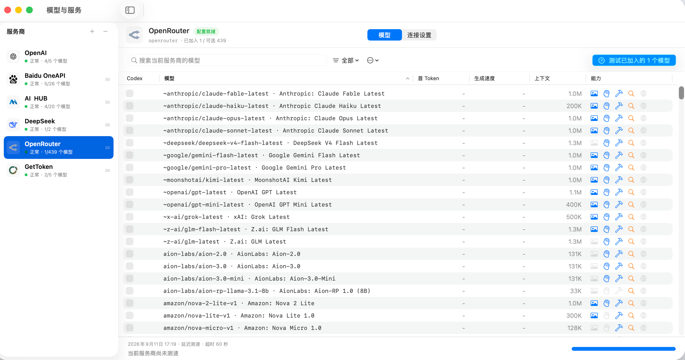

# Codex Mixin

  

  
  
  
  
  
  

  <b>Custom providers and official Codex, managed from one local control plane.</b> 
  Windows desktop app · native macOS menu bar app · full-screen TUI · reversible local gateway

  <a href="#中文">中文</a> ·
  <a href="#english">English</a> ·
  <a href="https://github.com/Edward-lyz/codex-mixin/wiki/Product-Tour">Product tour</a> ·
  <a href="https://github.com/Edward-lyz/codex-mixin/wiki">Wiki</a> ·
  <a href="https://github.com/Edward-lyz/codex-mixin/releases/latest">Download</a> ·
  <a href="https://github.com/Edward-lyz/codex-mixin/issues">Issues</a>

<table>
  <tr>
    <td width="50%" align="center">
       
      macOS · model catalog, capability state, selection and benchmark
    </td>
    <td width="50%" align="center">
       
      Terminal · gateway, providers, quota, token usage, TTFT and throughput
    </td>
  </tr>
  <tr>
    <td width="50%" align="center">
       
      Menu bar · lifecycle, quota, token usage, updates and logs
    </td>
    <td width="50%" align="center">
       
      Models and Services · discovery, capability state and selection
    </td>
  </tr>
  <tr>
    <td width="50%" align="center">
       
      Fusion · native Panel and Judge review rendered inside Codex
    </td>
    <td width="50%" align="center">
       
      Mobile · choose official or Mixin-managed models for remote tasks
    </td>
  </tr>
</table>

  <a href="https://github.com/Edward-lyz/codex-mixin/wiki/Product-Tour"><b>查看包含全部 macOS、TUI、Fusion 和移动端截图的 Product Tour</b></a>

## 中文

Codex Mixin 是一个跨平台 Rust 本地网关和 CLI，并提供 Windows 桌面 App、原生 macOS 菜单栏 App 与全屏 TUI。它把 OpenRouter、DeepSeek、Baidu OneAPI、AWS Bedrock 或其他兼容 OpenAI / Anthropic 协议的模型接入官方 Codex，同时保留官方 ChatGPT/OpenAI 账号路径、GPT 模型、远程控制和 Codex 原生体验。

Codex Mixin 不是 Codex 的二次发行版，也不重新打包官方 Codex App。Codex 仍然是主入口；Codex Mixin 负责模型接入、协议转换、模型目录、配置托管、后台服务、额度与性能观测。

### 核心能力

- 官方模型与自定义模型共存于 Codex 模型选择器，重名模型自动隔离，历史会话保持可用。
- 支持 OpenAI Responses、Chat Completions、Anthropic Messages 和 AWS Bedrock 上游。
- Windows 和 macOS 提供桌面控制面；Linux、SSH 和远端服务器提供全屏 TUI；所有平台共享可脚本化 CLI。
- 统一完成 Provider 管理、模型发现、能力探测、上下文配置、测速、额度和 Token 观测。
- Fusion 支持多模型 `Panel → Judge → Final` 编排和按时间轮转，并生成 Codex 原生 Review。
- 本地网关只监听 loopback，默认由操作系统动态分配端口，并把实际端点同步给已连接客户端。
- 配置以加密形式落盘，可导出为 Base64 备份并在另一台机器一键导入。
- Codex、Claude Code、DSH、OpenCode 和 Pi 的集成均可安装、同步和恢复。

### 产品形态

| 组件 | 作用 |
| --- | --- |
| Rust gateway | 协议转换、鉴权、流式转发、模型路由、Fusion 和观测 |
| macOS App | 菜单栏状态、Provider 与模型管理、测速、配置备份、更新和修复 |
| Windows App | 系统托盘、Provider 与模型管理、测速、配置备份、客户端接入和修复 |
| TUI | 面向 Linux、SSH 和远端环境的完整终端控制台 |
| CLI | 跨平台 core：稳定子命令、JSON contract 和后台服务管理 |

### 内置 Provider

| Provider | 主要协议 |
| --- | --- |
| Baidu OneAPI | Anthropic Messages / OpenAI Responses |
| OpenRouter | OpenAI Chat Completions |
| DeepSeek | OpenAI Chat Completions |
| OpenCode Go | OpenAI Responses |
| AWS Bedrock | Anthropic Messages |
| Custom | OpenAI Responses、Chat Completions 或 Anthropic Messages |

### 文档

完整安装、配置和排障资料维护在 [GitHub Wiki](https://github.com/Edward-lyz/codex-mixin/wiki)：

- [产品展示](https://github.com/Edward-lyz/codex-mixin/wiki/Product-Tour)
- [安装](https://github.com/Edward-lyz/codex-mixin/wiki/Installation) 与 [快速开始](https://github.com/Edward-lyz/codex-mixin/wiki/Quick-Start)
- [配置备份与恢复](https://github.com/Edward-lyz/codex-mixin/wiki/Configuration-Backup-and-Restore)
- [Provider 与模型](https://github.com/Edward-lyz/codex-mixin/wiki/Providers-and-Models)
- [客户端集成](https://github.com/Edward-lyz/codex-mixin/wiki/Client-Integrations) 与 [Fusion](https://github.com/Edward-lyz/codex-mixin/wiki/Fusion)
- [CLI 参考](https://github.com/Edward-lyz/codex-mixin/wiki/CLI-Reference)
- [排障](https://github.com/Edward-lyz/codex-mixin/wiki/Troubleshooting) 与 [常见问题](https://github.com/Edward-lyz/codex-mixin/wiki/FAQ)

> Base64 仅是编码，不是加密。配置备份包含 Provider API Key、AWS 凭据和本地访问密钥，请按敏感文件保管。

## English

Codex Mixin is a cross-platform Rust local gateway and CLI with a Windows desktop app, a native macOS menu bar app, and a full-screen TUI. It connects OpenRouter, DeepSeek, Baidu OneAPI, AWS Bedrock, and other OpenAI- or Anthropic-compatible providers to official Codex while preserving ChatGPT sign-in, official GPT models, remote control, and the native Codex experience.

It is not a fork or repackaging of Codex. Codex remains the primary interface. Codex Mixin supplies provider routing, protocol conversion, model catalogs, reversible configuration management, background service control, quota reporting, and performance observability.

Highlights include:

- Official and custom models in one Codex model picker.
- Windows and native macOS controls plus a complete Linux and SSH TUI.
- OpenAI Responses, Chat Completions, Anthropic Messages, and AWS Bedrock support.
- Provider discovery, capability probing, benchmarking, quota, token, TTFT, and throughput views.
- Multi-model and time-rotation Fusion workflows with native Codex Review output.
- Loopback-only gateway endpoints with OS-assigned ports and automatic client synchronization.
- Encrypted local storage and portable Base64 configuration backups.
- Reversible integrations for Codex, Claude Code, DSH, OpenCode, and Pi.

See the [Product Tour](https://github.com/Edward-lyz/codex-mixin/wiki/Product-Tour) for the complete macOS, TUI, Fusion, and mobile gallery. The [GitHub Wiki](https://github.com/Edward-lyz/codex-mixin/wiki) contains installation, tutorials, CLI reference, backup and restore, security, troubleshooting, and FAQs.

## License

See [LICENSE](LICENSE) and [NOTICE](NOTICE).
