# Codex Mixin

<p align="center">
  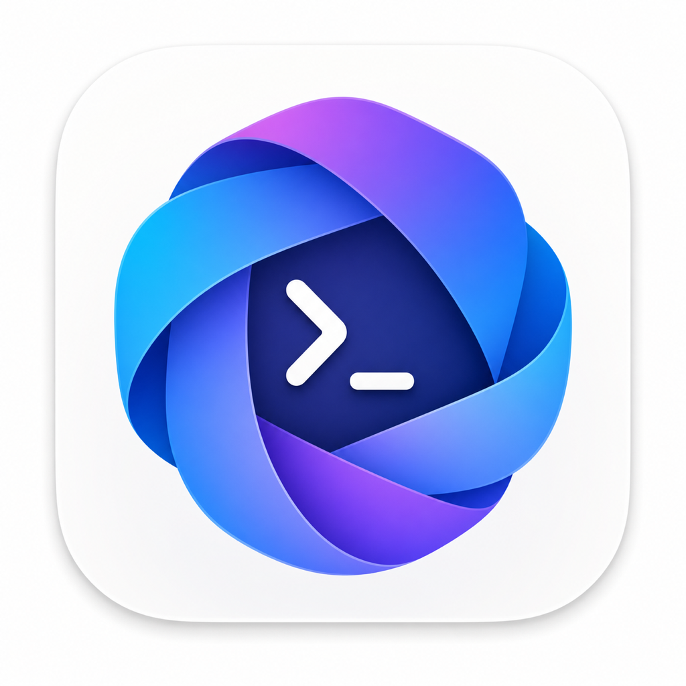
</p>

<p align="center">
  <a href="https://github.com/Edward-lyz/codex-mixin/actions/workflows/ci.yml"></a>
  <a href="https://github.com/Edward-lyz/codex-mixin/releases/latest"></a>
  <a href="https://github.com/Edward-lyz/codex-mixin/releases"></a>
  <a href="LICENSE"></a>
  
</p>

<p align="center">
  <b>Custom providers and official Codex, managed from one local control plane.</b><br>
  <sub>Native macOS menu bar app · full-screen TUI · reversible local gateway</sub>
</p>

<p align="center">
  <a href="#中文">中文</a> ·
  <a href="#english">English</a> ·
  <a href="#product-tour--产品界面">Product tour</a> ·
  <a href="https://github.com/Edward-lyz/codex-mixin/releases/latest">Download</a> ·
  <a href="https://github.com/Edward-lyz/codex-mixin/issues">Issues</a>
</p>

<table>
  <tr>
    <td width="50%" align="center">
      <a href="docs/assets/APP-model-picker.png">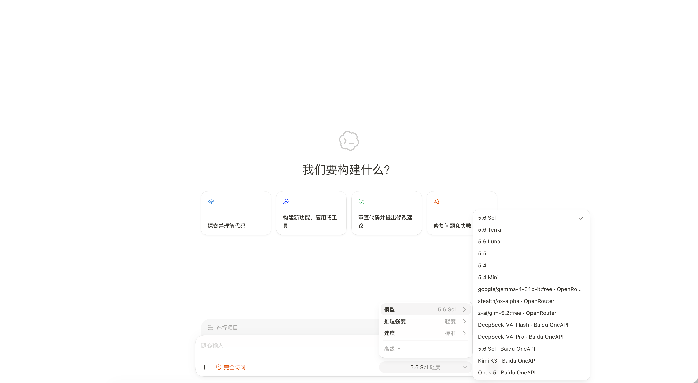</a><br>
      <sub>macOS · model catalog, capability state, selection and benchmark</sub>
    </td>
    <td width="50%" align="center">
      <a href="docs/assets/CLI-Home.png">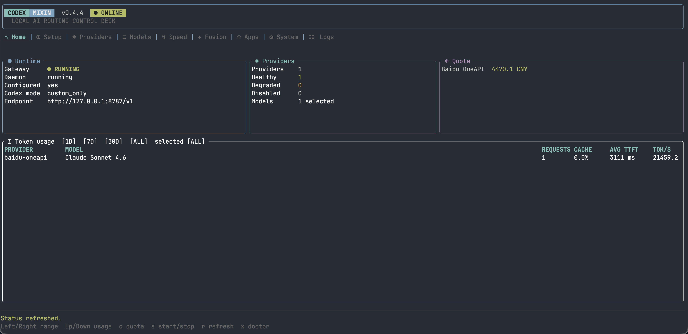</a><br>
      <sub>Terminal · gateway, providers, quota, token usage, TTFT and throughput</sub>
    </td>
  </tr>
</table>

## Product tour · 产品界面

Codex Mixin 为本机 macOS 用户提供原生菜单栏 App，也为 Linux、SSH 和远端开发机提供功能完整的全屏 TUI。两套界面共享同一份配置、后台网关和 CLI 命令，不需要在易用性与可自动化之间二选一。

Codex Mixin offers a native menu bar app for macOS and a complete full-screen TUI for Linux, SSH, and remote development. Both surfaces operate the same config, gateway, and CLI contract.

### macOS control center

<table>
  <tr>
    <td width="34%" align="center">
      <a href="docs/assets/APP-MainMenu.png">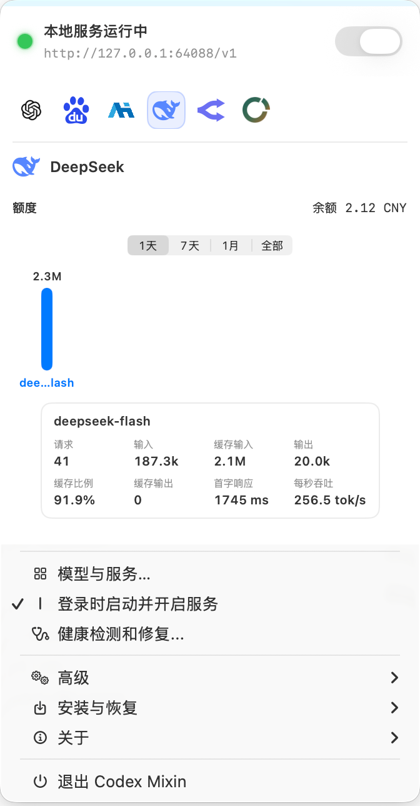</a><br>
      <sub>Service lifecycle, quota, integrations, updates and logs</sub>
    </td>
    <td width="66%" align="center">
      <a href="docs/assets/APP-Provider-Set.png">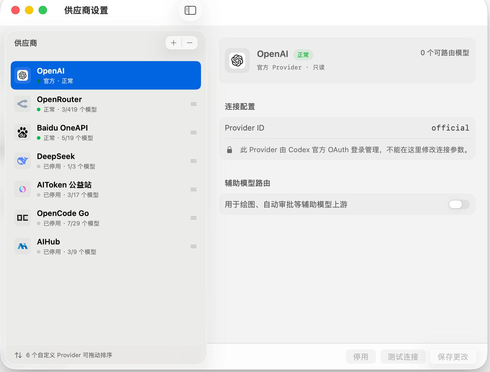</a><br>
      <sub>Provider credentials, DUCX authentication, reporting and upstream options</sub>
    </td>
  </tr>
  <tr>
    <td colspan="2" align="center">
      <a href="docs/assets/APP-model-test.png">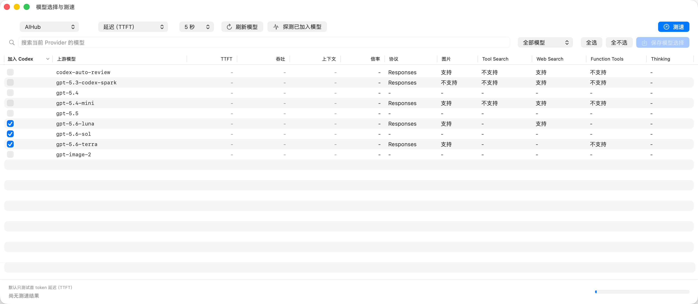</a><br>
      <sub>Per-model TTFT, output speed, token usage, total latency and quota cost</sub>
    </td>
  </tr>
</table>

### Full-screen terminal control deck

Run `codex-mixin` without arguments to open the mouse-enabled TUI. It covers first-run setup, Provider management, model selection, benchmarking, Fusion, application integrations, upgrades, repair and logs.

<details>
<summary><b>Open the complete TUI gallery · 展开完整 TUI 页面</b></summary>
<br>
<table>
  <tr>
    <td width="100%" align="center"><a href="docs/assets/CLI-Setup.png">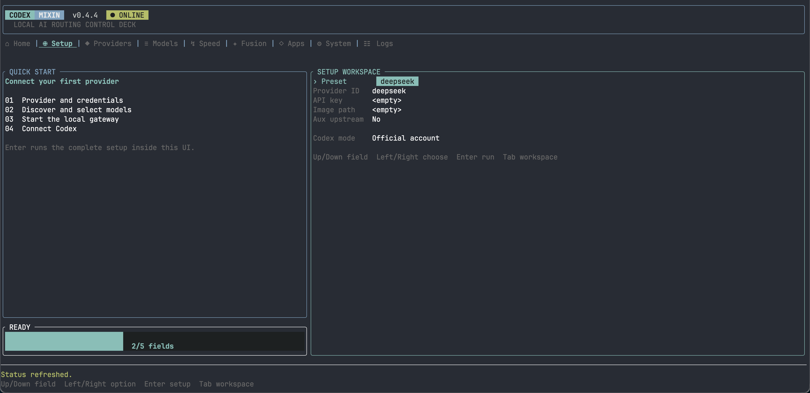</a><br><sub>Setup · provider, credentials and Codex mode</sub></td>
  </tr>
  <tr>
    <td width="100%" align="center"><a href="docs/assets/CLI-Providers.png">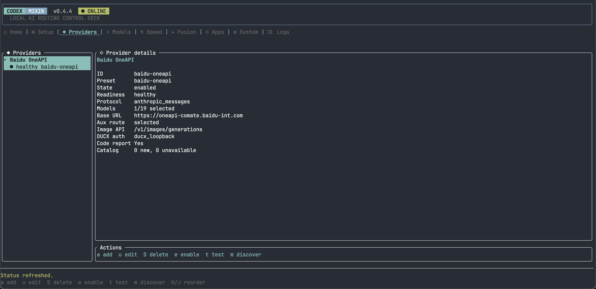</a><br><sub>Providers · readiness, authentication and routing</sub></td>
  </tr>
  <tr>
    <td width="100%" align="center"><a href="docs/assets/CLI-models.png">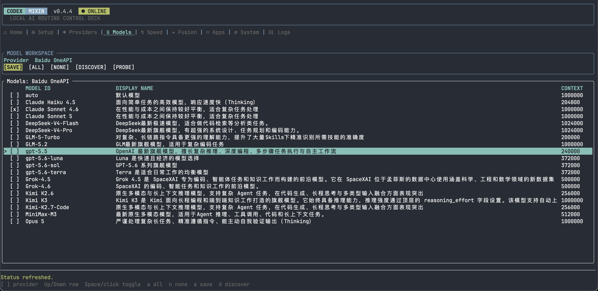</a><br><sub>Models · discover, probe and multi-select</sub></td>
  </tr>
  <tr>
    <td width="100%" align="center"><a href="docs/assets/CLI-Speed.png">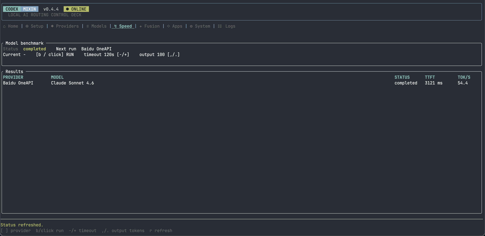</a><br><sub>Speed · TTFT, throughput and run controls</sub></td>
  </tr>
  <tr>
    <td width="100%" align="center"><a href="docs/assets/CLI-Fusion.png">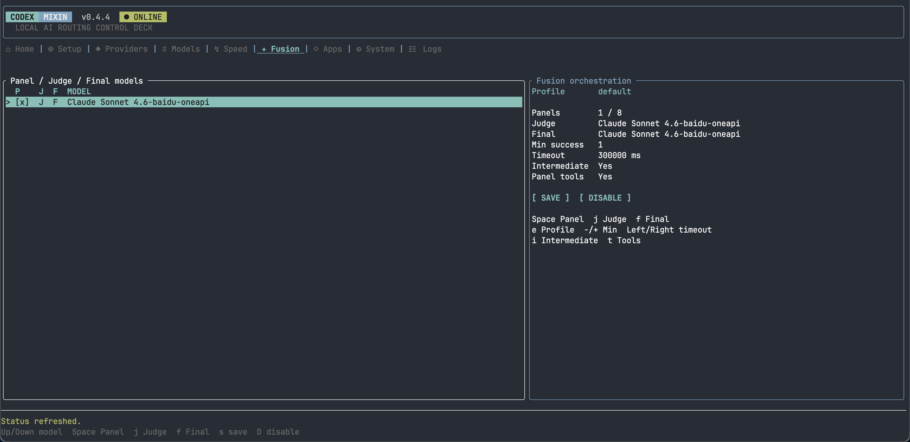</a><br><sub>Fusion · Panel, Judge and Final orchestration</sub></td>
  </tr>
  <tr>
    <td width="100%" align="center"><a href="docs/assets/CLI-Apps.png">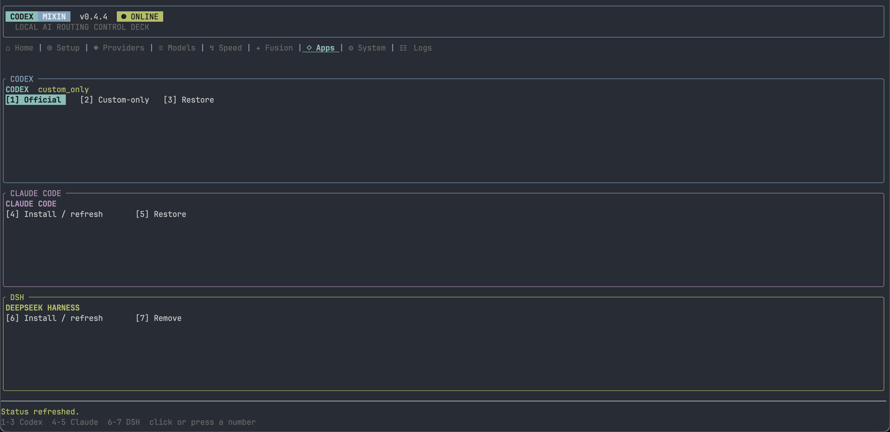</a><br><sub>Apps · install and restore Codex, Claude Code, DSH and OpenCode</sub></td>
  </tr>
  <tr>
    <td width="100%" align="center"><a href="docs/assets/CLI-System.png">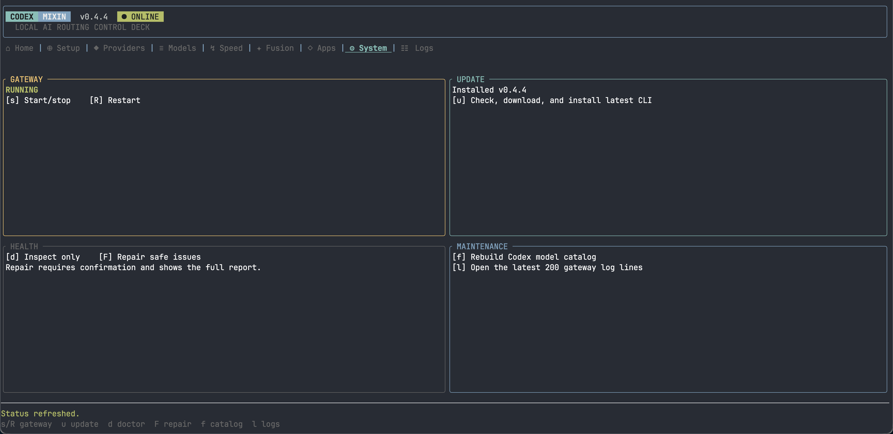</a><br><sub>System · gateway, updates, doctor and catalog repair</sub></td>
  </tr>
  <tr>
    <td width="100%" align="center"><a href="docs/assets/CLI-Logs.png">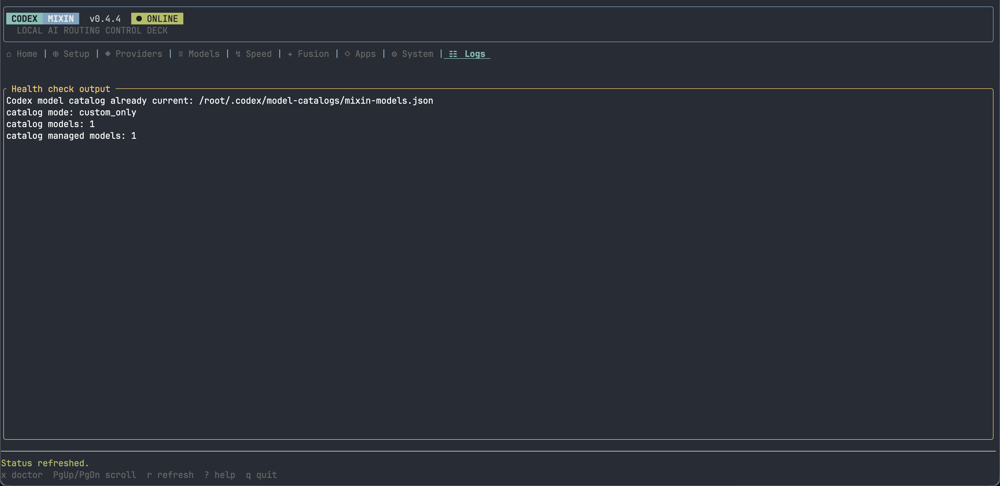</a><br><sub>Logs · health checks and actionable diagnostics</sub></td>
  </tr>
</table>
</details>

### Native Fusion review and project identity

<table>
  <tr>
    <td width="62%" align="center">
      <a href="docs/assets/fusion-review.png">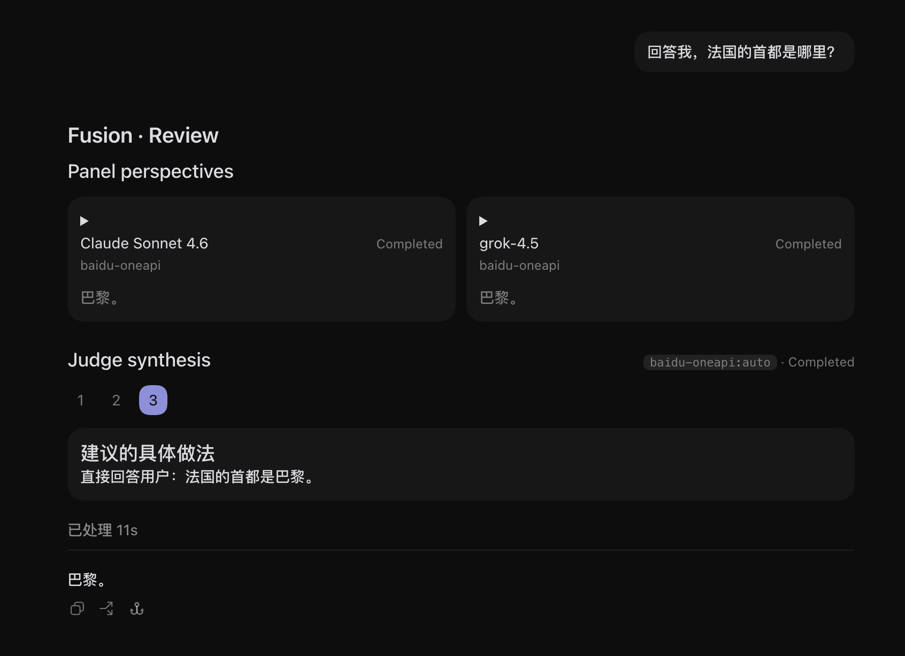</a><br>
      <sub>Fusion · Review uses Codex-native expandable Panel and Judge results</sub>
    </td>
    <td width="38%" align="center">
      <a href="docs/assets/APP-About.png">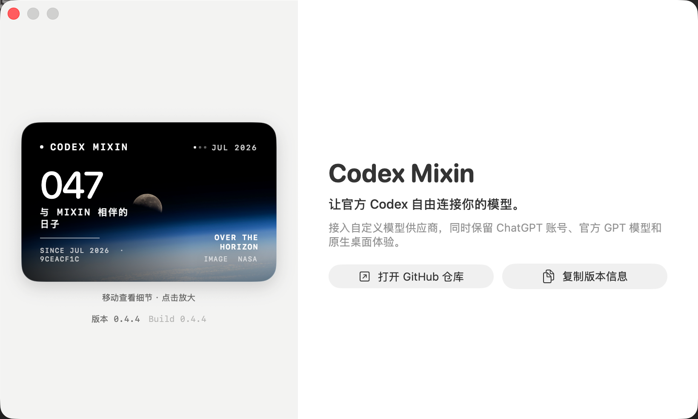</a><br>
      <sub>Version, build, project link and local Mixin card</sub>
    </td>
  </tr>
</table>

### Remote mobile model selection · 移动端远程选模型

Mixin-managed custom models remain available when remotely creating a Codex task from mobile. Choose an official or custom model directly in the native new-task model picker, without returning to the development machine.

通过移动端远程新建 Codex 会话时，Mixin 托管的自定义模型仍会出现在原生模型选择器中。无需回到开发机，即可直接选择官方或自定义模型开始任务。

<p align="center">
  <a href="docs/assets/Mobile_Choice.PNG">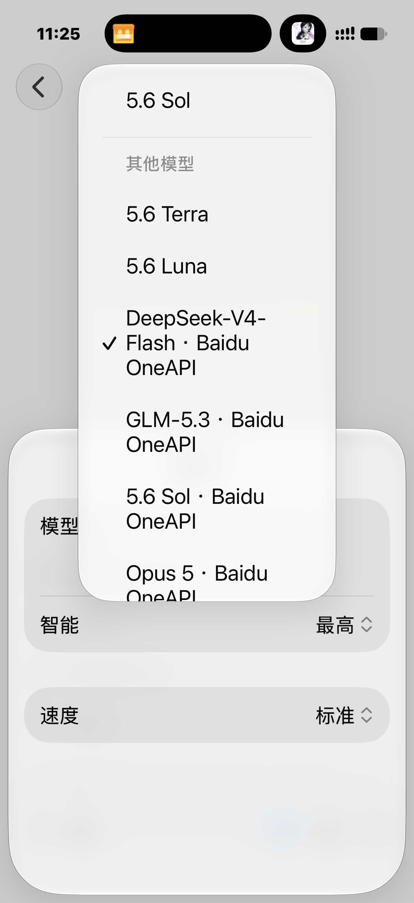</a><br>
  <sub>Mobile remote control · create a task with an official or Mixin-managed custom model</sub>
</p>

## 中文

Codex Mixin 是一个 Rust 本地网关、CLI 和 macOS 菜单栏 App。它把 OpenRouter、DeepSeek、Baidu OneAPI 或其他 OpenAI Chat Completions / Anthropic Messages 兼容模型接入官方 Codex，同时保留官方 ChatGPT/OpenAI 账号路径、官方 GPT 模型、远程控制和 Codex 原生体验。

它不是 Codex 的二次发行版，也不重新打包官方 Codex App。Codex 仍然是主入口，Codex Mixin 只负责模型接入、协议转换、模型目录生成、配置托管、服务常驻和额度展示。

### 目录

- [快速安装](#快速安装)
- [快速使用](#快速使用)
- [供应商预设](#供应商预设)
- [安装到 Codex](#安装到-codex-的行为)
- [Claude Code、DSH、OpenCode 与 Pi](#安装到-claude-code)
- [Fusion 多模型编排](#fusion-多模型编排)
- [CLI](#cli)
- [Prompt 缓存优化](#prompt-缓存优化)
- [数据位置](#数据位置)
- [常见问题](#常见问题)

### 为什么需要它

很多团队和个人已经有自己的模型入口，例如内部 OneAPI、OpenRouter、DeepSeek 或自建兼容网关。但 Codex 的真实使用场景不只是发一次 API 请求，用户还希望保留这些能力：

- 继续使用 ChatGPT 账号登录后的官方 Codex 能力。
- 官方 GPT 模型和自定义模型能在同一个模型选择器里出现。
- 新会话可以用自定义模型，旧会话不会因为 provider 被改掉而看起来消失。
- Codex model catalog 字段完整，不缺 context window、instructions template 等必需字段。
- 本地网关能长期运行，不依赖一个不能关闭的终端窗口。
- 普通用户不需要理解 `/v1/messages`、`/v1/chat/completions`、`/anthropic` 等路径差异。
- API 额度能在菜单栏里用可读方式展示，而不是显示一整段原始 JSON。

Codex Mixin 的解法是：Codex 连到本机自动分配的 loopback 端口，本地网关再按 provider 把请求转成上游需要的协议，并把流式响应转回 Codex 能理解的 Responses 形态。端口会持久化；若已被占用，网关会自动选择空闲端口并同步 Codex 配置。

### 功能特性

- **官方与自定义模型共存**：官方 GPT 保留 Codex OAuth、官方后端和账号能力；自定义模型进入同一个模型目录，重名模型自动隔离，历史会话继续可见。
- **完整 Provider 控制面**：内置常用 preset，也支持自定义 OpenAI Responses、Chat Completions 和 Anthropic Messages 上游；密钥、DUCX 认证、额度、数据上报、辅助模型和生图路径都可配置。
- **macOS 与 TUI 功能对齐**：本机使用原生菜单栏 App，Linux、SSH 和远端开发机使用支持鼠标与键盘的全屏 TUI；脚本继续使用稳定的 subcommand 和 `--json` 输出。
- **模型选择、测速与观测**：统一完成模型发现、能力探测、多选和保存，持续展示 TTFT、TPS、Token、缓存命中、额度与运行日志。
- **Fusion 与 Codex 原生能力**：Panel、Judge、Final 多模型编排可生成原生交互式 Review；官方和自定义模型都保留 Thinking、Web Search、图片生成与 prompt-cache 优化路径。
- **本地、常驻、可恢复**：Rust 网关只监听 loopback，自动管理端口和后台服务；安装前备份 Codex 配置，卸载时恢复 provider、登录和历史索引。

### 快速安装

#### macOS 菜单栏 App

从 [GitHub Releases](https://github.com/Edward-lyz/codex-mixin/releases/latest) 下载当前 Mac 架构对应的 DMG：

| Mac 架构 | 下载文件 |
| --- | --- |
| Apple Silicon | `codex-mixin-<version>-aarch64-apple-darwin.dmg` |
| Intel | `codex-mixin-<version>-x86_64-apple-darwin.dmg` |

菜单栏 App 支持 macOS 13.1 Ventura 及以上版本。打开 DMG，把 `Codex Mixin.app` 拖到 `Applications`，然后启动菜单栏 App。

发布包带有有效的 ad-hoc bundle 签名，但尚未使用 Apple Developer ID 签名，也未 notarize。如果 Gatekeeper 拦截，执行下面命令后再打开：

```bash
xattr -dr com.apple.quarantine "/Applications/Codex Mixin.app"
```

打开后按菜单栏提示完成配置。

#### Linux、SSH 与远端开发机

从同一个 Release 页面下载当前架构的 CLI 压缩包或 `.deb`。解压后直接运行 `codex-mixin` 二进制，不附带任何 subcommand：

```bash
./codex-mixin
```

第一次启动会把当前二进制安装到 Linux 常用的用户级目录 `~/.local/bin/codex-mixin`，随后进入全屏 TUI。没有 Provider 配置时会自动打开 Setup 页面，不需要运行 `codex-mixin setup`。

<details>
<summary>CLI 下载文件名</summary>

- macOS Apple Silicon: `codex-mixin-cli-<version>-aarch64-apple-darwin.tar.gz`
- macOS Intel: `codex-mixin-cli-<version>-x86_64-apple-darwin.tar.gz`
- Linux x86_64: `codex-mixin-cli-<version>-x86_64-unknown-linux-musl.tar.gz` 或 `codex-mixin-<version>-x86_64-unknown-linux-musl.deb`
- Linux ARM64: `codex-mixin-cli-<version>-aarch64-unknown-linux-musl.tar.gz` 或 `codex-mixin-<version>-aarch64-unknown-linux-musl.deb`

</details>

### 快速使用

#### 本地 Codex App 用户

1. 打开 `Codex Mixin.app`。
2. 点击菜单栏图标，选择 `供应商设置...`。
3. 选择 provider，填入 API Key。上游地址只填根地址，不要填 `/v1/messages` 或 `/v1/chat/completions`。
4. 点击 `启动本地网关`。
5. 点击 `安装到 Codex...`，明确选择“官方账号模式”或“仅自定义模型模式”。
6. 重启 Codex App。
7. 在 Codex 模型选择器里选择可用模型。

界面和完整操作入口见上方 [Product tour](#product-tour--产品界面)。

#### Linux、SSH 与远端 Codex CLI 用户

**第 1 步：打开二进制。** 直接运行 `codex-mixin`，不要加 `setup`。首次使用会自动进入下面的 Setup 页面；之后启动则进入 Home。

<p align="center"><a href="docs/assets/CLI-Setup.png"></a></p>

**第 2 步：完成 Setup。** 用鼠标点击或方向键选择 Provider preset，填写凭据和 Provider 专属设置，再选择 Codex 模式。百度 OneAPI 可以在这里启用 DUCX、代码使用上报和辅助模型上游。按 `Enter` 后，TUI 会在当前界面依次完成 Provider 保存、模型发现、Gateway 启动和 Codex 接入；需要扫码时会切换到完整二维码页面。

**第 3 步：检查 Provider 并选择模型。** 打开 Providers 页面测试、启停、排序或编辑 Provider；再进入 Models 页面，用鼠标或 `Space` 选择要加入 Codex 的模型并保存。

<p align="center"><a href="docs/assets/CLI-Providers.png"></a></p>

<p align="center"><a href="docs/assets/CLI-models.png"></a></p>

**第 4 步：安装应用集成。** 进入 Apps 页面，直接选择 Codex 的官方账号模式或仅自定义模型模式，也可以安装、刷新或恢复 Claude Code、DSH、OpenCode 和 Pi。每个变更都会先显示确认页和执行进度。

<p align="center"><a href="docs/assets/CLI-Apps.png"></a></p>

**第 5 步：回到 Home 验证。** Home 会集中显示 Gateway、Provider、额度、Token、缓存、TTFT 和吞吐；Speed、System、Logs 页面分别负责测速、升级修复和诊断。安装或恢复 Codex 后，重启 Codex App 或开启新的 Codex CLI 会话即可看到最新模型。

<p align="center"><a href="docs/assets/CLI-Home.png"></a></p>

顶部标签支持鼠标点击，`Tab` 和 `Shift-Tab` 可切换页面，当前页面底部会始终显示可用快捷键。自动化脚本所需的稳定 subcommand 和 `--json` 接口收在后面的 [自动化 CLI 参考](#自动化-cli-参考)，普通用户不需要使用。

### 供应商预设

| Provider | 上游协议 | 上游根地址 | 对话接口 | 生图接口 | 模型接口 | 额度接口 |
| --- | --- | --- | --- | --- | --- | --- |
| `custom` | OpenAI Responses 默认 | 用户填写 | `/v1/responses` | 可选，用户填写 | `/v1/models` | 自动探测常见只读端点 |
| `baidu-oneapi` | Anthropic Messages | `https://oneapi-comate.baidu-int.com` | `/v1/messages` | `/v1/images/generations` | `POST /openapi/v2/available_models` | `/openapi/v3/user/quota` |
| `openrouter` | OpenAI Chat Completions | `https://openrouter.ai/api` | `/v1/chat/completions` | 可选，用户填写 | `/v1/models` | `/v1/credits` |
| `deepseek` | OpenAI Chat Completions | `https://api.deepseek.com` | `/chat/completions` | 可选，用户填写 | `/models` | 无默认值 |
| `opencode-go` | OpenAI Responses | `https://opencode.ai/zen/go` | `/v1/responses` | 无 | `/v1/models` | dashboard `/workspace/{id}/go` + `/billing` |
| `aws-bedrock` | Anthropic Messages (Mantle) | `https://bedrock-mantle.us-east-1.api.aws/anthropic` | `/v1/messages` | 无 | AWS Bedrock control plane | 无默认值 |

固定 preset 的上游地址和路径由 preset 管理；`custom` provider 会自动探测模型列表和响应接口，不发起有效模型推理。
Baidu OneAPI 的额度接口必须同时填写额度用户名；CLI 和 App 都会在保存时校验。
OpenCode Go 的额度显示需要额外填写工作区 ID 和 `opencode.ai` 的 `auth` cookie；
这两个值可以在浏览器控制台里从 OpenCode Go dashboard 页面取得，cookie 过期后需要重新填写。
`aws-bedrock` 使用 Amazon Bedrock Mantle 原生 Anthropic Messages 接口。新增 Provider 时填写
AWS Region、Access Key ID、Secret Access Key，以及可选的 Session Token；Codex Mixin 会按
`bedrock-mantle` service 生成 SigV4 签名，并根据 Region 自动生成 Mantle URL。当前只支持显式
输入 AK/SK，不读取 AWS SSO profile 或默认 credential chain。旧配置中的 Bedrock API key
仍可继续使用，但新的 App 和 TUI 入口默认使用 AK/SK。
模型刷新会通过 SigV4 读取 `ListInferenceProfiles(APPLICATION)`、
`ListInferenceProfiles(SYSTEM_DEFINED)` 和 `ListFoundationModels`，再合并账号折扣 profile、
官方跨区 profile 与当前 Region 的基础模型目录。
新增或更新 `custom` 供应商时，会先验证 `GET /v1/models` 的 JSON 结构，再按
`/v1/responses` → `/v1/messages` → `/v1/chat/completions` 顺序探测响应协议；整组 `/v1`
接口失败后，再尝试 `/models`、`/responses`、`/messages` 和 `/chat/completions`。
新增 Provider 首次成功读取模型目录时，默认选择排序后的前 10 个模型；后续刷新保留用户
选择，新发现的模型仅标记为待选择。
HTML、普通页面和无关 JSON 不会被当作接口。
Baidu OneAPI 不参与该探测，使用预设协议。
预设供应商的协议在离线验证后写死，例如 OpenCode Go 使用 `/v1/responses`。
启用 Baidu OneAPI 时可以选择「DUCX 核心」。DUCX 是 header 产生器：
网关监听成功后在后台启动一个有序的短命认证回合，从该回合发出的 OneAPI 请求中抓取
`comate_custom_header`、`Authorization` 等原生 Header，并缓存 60 秒。启动预热与首个真实
请求共享同一把缓存锁，并发时也只会启动一个 warmup。抓取后立即终止整个进程组，不会把
请求转发到真实 OneAPI，也不会留下 DUCX 后代进程。

真实模型请求始终由调用方决定，Header 由所选认证核心产生并注入到 Mixin 自己的上游请求。
Fusion、Web Search、画图和 Auto Review 产生的子请求走同一个统一执行层，不会绕过用户
选择的核心。上报 hook 与认证核心解耦：配置里单独保存 data-report 二进制路径，运行时
不再读取 DUCX 的认证路径。

选择 DUCX 核心时，macOS App 会把独立副本下载到
`~/.codex-mixin/ducx/home/`，不会直接执行官方安装脚本；下载完成后，
独立 Terminal 会显示进度并执行托管副本的登录，扫码成功后自动关闭并继续保存。
Provider 可通过 `--header-env NAME=ENV_VAR` 转发用户自行提供的自定义请求头。配置文件
只保存 Header 名和环境变量名，不保存值；网关启动时读取一次，缺失或空值会阻止启动，
更新值后需重启网关。`authorization`、`x-api-key`、`comate_custom_header` 和传输层
Header 不允许覆盖；`comate_custom_header` 只允许由当前认证核心产生。Codex Mixin
不生成、校验或授权任何凭据，用户须自行确认对相关账号、凭据和服务有使用权。DUCX
会把托管登录得到的 `Authorization: Bearer ...` 以及
`comate_custom_header` 注入到 Mixin 的上游请求，不删除也不替换。data-report 会继续执行
managed settings 中的 SessionStart、UserPromptSubmit、Stop、SessionEnd
`data-report` hooks，把这些使用次数标记为百度 OneAPI Token 流量。
新增或刷新 `custom` Provider 时会并发尝试 New API、Sub2API、OpenRouter
等常见只读额度端点；只有返回可识别额度数据的端点才会保存，不会发起付费推理。

示例：

- OpenRouter 填 `https://openrouter.ai/api`，不要填 `/v1/chat/completions`。
- DeepSeek 填 `https://api.deepseek.com`，不要填 `/chat/completions`。
- Amazon Bedrock 填 AK/SK 和 Region；临时凭据再填写 Session Token。
- 旧式或非标准网关也会在标准 `/v1` 接口失败后自动尝试去掉 `/v1` 的路径。

Provider 设置界面见上方 [macOS control center](#macos-control-center)；远端用户可在同一 TUI workspace 中完成等价配置。

### 安装到 Claude Code

Codex Mixin 也提供一个 Anthropic Messages 兼容端点 `/v1/messages`，所以 Claude Code
可以直接把本地网关当作上游使用。在 macOS 菜单栏或 TUI 的 Apps 页面选择「安装到
Claude Code」后，会直接写入当前已启用且已选择的模型。

1. 备份并保留 `~/.claude/settings.json` 中已有的 `env` 配置。
2. 在 `env` 中写入 `ANTHROPIC_BASE_URL=http://127.0.0.1:<端口>` 和
   `ANTHROPIC_AUTH_TOKEN`。网关配置了 `gateway_api_key` 时使用该值；否则使用本地占位
   token，让 Claude Code 无需登录 Anthropic。
3. 写入 `CLAUDE_CODE_DISABLE_NONESSENTIAL_TRAFFIC=1`，停止非必要官方流量；
   `DISABLE_LOGIN_COMMAND=1` 隐藏不适用的官方登录入口。不启用 Claude 内部 Cloud
   Gateway 模式。
4. 把所有已启用且已选择的模型写入顶层 `modelPicker`，让 Claude Code 的模型选择器直接
   展示并请求 Codex Mixin 的可路由模型 ID，不再写入 Opus、Sonnet、Haiku 映射或
   `modelOverrides`。模型目录中的 context window 会显示在描述中；达到 1M 的模型会带
   `[1m]` 后缀，让 Claude Code 使用 1M window，并在请求前自动移除后缀。其他未知模型
   关闭 Claude Code 固定 200K window enforcement，由上游的真实 context limit 决定何时
   compact。顶层 `model` 默认使用 picker 中的第一个模型。
5. 写入 `codex_mixin_managed` 标记，卸载时恢复之前的 `env`、`model`、`modelPicker` 和
   历史版本管理过的 `modelOverrides`。

需要卸载时，在同一个 Apps 页面选择 Claude Code 的 `Restore`。CLI 使用
`codex-mixin connect claude` 安装。

### 安装到 DSH

DeepSeek Harness（DSH）可以通过 pi-ai adapter 使用本地网关。在 macOS 菜单栏选择
「安装到 DSH...」，或在 TUI 的 Apps 页面点击 DSH 的 `Install / refresh` 后，会：

1. 在 `$DSH_HOME/settings.yaml` 的 `llm-pi-ai.providers.codex-mixin` 写入
   `openai-responses` 路由，`baseURL` 指向本地网关的 `/v1`。
2. 把当前已启用 provider 的已选模型和 Fusion 虚拟模型写入该路由的 `models`，
   使用网关公开的 provider-qualified catalog slug。
3. 在 `$DSH_HOME/.credentials.yaml` 写入 `CODEX_MIXIN_GATEWAY_API_KEY`。网关配置了
   `gateway_api_key` 时写入该值；未配置时写入本地占位值，DSH 仍能通过无鉴权网关。
4. 卸载时删除 `llm-pi-ai.providers.codex-mixin` 和
   `CODEX_MIXIN_GATEWAY_API_KEY`，保留 DSH 的其他配置。

需要卸载时，在同一个 Apps 页面选择 DSH 的 `Remove`。DSH 目录默认使用 `$DSH_HOME`，未设置时使用 `~/.dsh`。安装或卸载后需要重启 DSH 或开启新会话。

### 安装到 OpenCode

在 macOS 菜单栏选择「安装到 OpenCode...」，或在 TUI 的 Apps 页面点击 OpenCode 的
`Install / refresh`。CLI 使用 `codex-mixin connect opencode`。安装会：

1. 在 `~/.config/opencode/opencode.json` 合并一个 `codex-mixin` provider，保留已有
   provider、plugin、默认模型和其他字段；也支持 `OPENCODE_CONFIG` 与
   `XDG_CONFIG_HOME`。
2. 使用 `@ai-sdk/openai` 连接网关的 `/v1/responses`。Mixin 会继续把请求转换到各
   provider 的 OpenAI Responses、Chat Completions 或 Anthropic Messages 上游，因此
   OpenCode 不需要按上游协议切换配置。
3. 加入当前已选的 custom、OpenAI official 和 Fusion 模型，但不会替用户修改 OpenCode
   的默认模型。打开 `/models` 选择 `codex-mixin/<模型>`。
4. 为支持 thinking 的模型加入 `none`、`low`、`medium`、`high`、`xhigh` 和 `max`
   variants；用 OpenCode 的 variant selector 或 `variant_cycle` 切换。
5. 把网关凭据写入权限为 `0600` 的 `~/.codex-mixin/opencode-api-key`，OpenCode 配置只保存
   `{file:...}` 引用。卸载只删除 Mixin 管理的 provider 和该凭据文件。

初版只改写 strict JSON。现有 `opencode.json` 如果包含 JSONC 注释，安装会明确失败，避免
破坏注释。初版不安装 OpenCode plugin/hooks：OpenCode 插件接口本身可用，但 Codex Mixin
现有 reporting hook 的事件格式只适配 Codex、Claude Code 和 DSH，需要独立 adapter 才能
保证事件语义正确。安装或卸载后请重启 OpenCode 或开启新会话。

### 安装到 Pi

在 macOS 菜单栏选择「安装到 Pi...」，在 TUI Apps 页面按 `p`，或运行
`codex-mixin connect pi`。安装会：

1. 在 `$PI_CODING_AGENT_DIR/models.json`（默认 `~/.pi/agent/models.json`）合并一个
   `codex-mixin` provider，并保留其他 provider 和顶层字段。
2. 使用 Pi 原生 `openai-responses` adapter 连接本地网关 `/v1/responses`，加入当前已选的
   custom、OpenAI official 和 Fusion 模型；支持图片输入的模型会保留该能力。
3. 为 thinking 模型暴露 `off`、`minimal`、`low`、`medium`、`high`、`xhigh` 和 `max`。
4. 把 Pi 专用网关凭据写入权限为 `0600` 的 `~/.codex-mixin/pi-api-key`，Pi 配置只保存
   `!cat` 引用。
5. 启用百度代码用量上报时，在 `~/.pi/agent/extensions/codex-mixin-report.ts` 安装受管
   Hooks adapter。它只观察 `codex-mixin` provider，把用户请求、`apply_patch` / `edit` /
   `write` 的生成与采纳事件以及每轮 transcript 交给 Codex Mixin 的持久化重试队列。

卸载使用 `codex-mixin connect remove pi`。它只删除带 Codex Mixin 标记的 provider、凭据
和 Hooks，不修改其他 Pi 配置。安装、刷新或卸载后，在 Pi 中运行 `/reload` 或开启新会话。

### 安装到 Codex 的行为

macOS 安装面板和 TUI 的 Apps 页面都提供两种互斥模式：

| 模式 | TUI 选项 | `models_cache.json` | 安装结果 |
| --- | --- | --- | --- |
| 官方账号模式 | Apps → Codex → `Official` | 必须存在；请先登录并打开一次 Codex | 合并官方 GPT 与自定义模型，保留官方 OAuth、插件、云任务和账户能力 |
| 仅自定义模型模式 | Apps → Codex → `Custom-only` | 不依赖、不要求存在 | 备份并临时替换 Codex 登录，用本地登录占位开启模型选择器；官方插件、云任务和账户功能不可用 |

Codex Mixin 不会根据 `auth.json` 或 `models_cache.json` 猜测模式，确认页会完整展示即将应用的选择。即使你有官方账号，也可以明确选择仅自定义模型模式；如果想使用官方能力，请先取消安装，在 Codex 中登录并打开一次，然后选择官方账号模式。

安装会做这些事：

1. 读取上游 models 接口，生成 Codex 可用的模型目录。
2. 写入独立模型目录文件 `~/.codex/model-catalogs/mixin-models.json`。
3. 备份当前 `~/.codex/config.toml`。
4. 官方账号模式注册独立的 `codex-mixin` provider；仅自定义模式复用 Codex 内置 `amazon-bedrock` provider，并只把它的 `base_url` 指向本地网关。两种模式都不覆盖内置 `openai` provider。
5. 将顶层 `model_provider` 设置为当前模式对应的托管 provider。
6. 将现有 JSONL 和 SQLite 历史索引迁移到当前托管 provider，并保留迁移前备份。
7. 官方账号模式写入 `requires_openai_auth = true` 和 `supports_websockets = true`。仅自定义模式使用本地 Bedrock-shaped 登录占位；Codex Desktop 对该账户类型不应用官方模型白名单，因此完整自定义目录会出现在模型选择器。
8. 仅自定义模型模式会把原 `~/.codex/auth.json` 备份到 `auth.json.codex-mixin.backup`；原文件不存在时写入 `auth.json.codex-mixin.absent` 标记，然后安装由 codex-mixin 管理的本地登录占位。

有账号模式的关键配置形态：

```toml
model_catalog_json = "/Users/you/.codex/model-catalogs/mixin-models.json"
model_provider = "codex-mixin"

[model_providers.codex-mixin]
name = "Codex Mixin"
base_url = "http://127.0.0.1:<自动分配端口>/v1"
wire_api = "responses"
requires_openai_auth = true
supports_websockets = true
```

仅自定义模型模式只覆盖内置 `amazon-bedrock` provider 允许覆盖的 `base_url`，并会把一个上游模型写成默认模型：

```toml
model = "DeepSeek-V4-Flash"
model_catalog_json = "/Users/you/.codex/model-catalogs/mixin-models.json"
model_provider = "amazon-bedrock"

[model_providers.amazon-bedrock]
base_url = "http://127.0.0.1:<自动分配端口>/v1"
```

最新版 Codex 禁止覆盖内置 `openai` provider，并严格限制内置 provider 可修改的字段。Codex Mixin 的官方账号模式使用独立的 `codex-mixin` provider；仅自定义模式只修改 `amazon-bedrock.base_url`，其余 Bedrock provider 字段保持 Codex 默认值。即使首次配置里没有 `model_provider` 或 `model_providers`，安装器也会补齐所需配置。有账号模式下，官方 GPT 请求由网关转发到官方 Codex backend；两种模式下的自定义模型请求都会转发到已配置的上游。

有账号模式安装后，可以在同一个 Codex 会话中从官方 GPT 切换到自定义模型，也可以再切回官方模型。Codex Mixin 会按每个 Responses WebSocket 请求重新分流，并在自定义模型连续调用时重建增量上下文。

默认不会改顶层 `model`。模型选择由 Models 页面管理；需要卸载并恢复安装前配置时，在 Apps 页面选择 Codex 的 `Restore`。

卸载会从备份配置读取原 provider；原配置没有显式 provider 时使用 Codex 默认的 `openai`。当前托管 provider 的历史会同步迁回该 provider，避免恢复配置后会话消失。仅自定义模型模式创建的本地登录占位会被删除，并恢复安装前的 `auth.json`；如果用户安装后自行改过登录，卸载会保留当前登录且不会用旧备份覆盖它。

从仅自定义模型模式切到官方账号模式时，先在 Apps 页面恢复 Codex，登录 Codex 并打开一次以生成模型缓存，再选择 `Official`。切回仅自定义模型模式时直接选择 `Custom-only`，当前官方登录会被备份。

安装或卸载后需要重启 Codex App。Codex CLI 需要开启新会话。

### 菜单栏 App

菜单栏 App 提供这些动作：

- `启动本地网关`：启动后台网关，不改变登录自启设置。
- `暂停本地网关`：停止当前后台网关。
- `重启本地网关`：按当前登录自启设置重启服务。
- `登录时启动并开启服务`：登录后同时打开菜单栏 App 和网关；开启时将当前 daemon 切换为 launchd 服务，关闭时将仍在运行的服务切回后台 daemon。
- `刷新状态与额度`：刷新服务状态和额度进度条。
- `供应商设置...`：新增、删除和启停 provider，填写 API Key、上游根地址和额度信息，并刷新上游模型缓存。
- `模型选择与测速...`：搜索、筛选和勾选要加入 Codex 的模型。保存模型选择和测速是独立按钮；选择有改动时必须先保存，测速不会隐式保存或重启网关。刷新模型只更新模型目录；探测已加入模型会验证其高级能力。下方结果表按模型显示 TTFT、TPS、usage、总耗时和状态，可点击表头切换升降序。关闭窗口或退出 App 不会停止后台测速，但重开窗口会清空上次测速结果。
- `Fusion 设置...`：选择 1–8 个 Panel 模型以及 Judge、Final 模型，并控制是否在回答中展示中间结果；也可以关闭 Fusion，从 Codex 模型选择器中移除对应虚拟模型。
- `安装到 Codex...`：选择有账号或仅自定义模型模式；先确保网关已启动，再按实际动态端口生成模型目录并写入托管 Codex 配置。未检测到 `models_cache.json` 时默认选择仅自定义模型。
- `从 Codex 恢复...`：恢复安装前备份并删除托管模型目录。
- `关于 Codex Mixin...`：显示当前 App 版本、Build 号和 GitHub 仓库链接，可一键复制版本信息；还可以打开只在本机生成的互动 Mixin 卡片并保存或分享 PNG。每次打开关于页时会随机选择一张与上次不同的当月 NASA 背景，窗口打开期间保持不变；老用户的天数会从 `~/.codex-mixin` 最早的创建时间回迁，全新安装则从第一次记录开始。
- `检查更新...`：查询 GitHub 最新 release，下载并打开当前架构对应的 DMG。
- `复制本地接口地址`：复制当前实际监听的本地接口地址。
- `打开运行日志`：打开当前日志 `~/.codex-mixin/gateway.log`；轮转前的日志保存在 `gateway.log.1`。
- `打开配置目录`：打开 `~/.codex-mixin`。

打开 App 会自动启动本地网关。关闭终端或退出菜单栏 App 后，后台网关仍可以继续运行；只有打开 `登录时启动并开启服务` 时才会安装菜单 App 和网关各自的 launchd agent。daemon 与 launchd 切换前会先等待旧进程退出，避免同时启动两个动态端口。未配置有效上游 API 时不会安装登录自启任务。需要临时停服务时使用菜单里的暂停动作。

### Fusion 多模型编排

Fusion 虚拟模型使用 `Panel → Judge → Final` 三段式管线。打开菜单栏的 `Fusion 设置...` 或 TUI 的 Fusion 页面，选择 1–8 个并行 Panel 模型、一个 Judge 模型和一个 Final 模型；保存后，`mixin/fusion/<profile-id>` 会出现在 Codex 模型选择器中。不再使用时，在同一界面点击 `关闭 Fusion`，网关会删除该 profile 并在刷新 catalog 后把它从模型选择器中移除。

Fusion 只在 Plan 模式的新用户轮次运行 Panel 和 Judge。切换到 Default 模式执行计划后，所有后续用户轮次与工具结果续跑都直接交给该 profile 的 Final 模型，避免在编码阶段重复分析。

交互效果见上方 [Native Fusion review](#native-fusion-review-and-project-identity)。

高级选项 `在回答中显示 Panel / Judge 中间结果` 默认开启，对应 stored config 中的 `show_intermediate_results: true`。开启后，Codex Mixin 会直接使用 Codex 原生 inline visualization：

1. Panel 输出按配置顺序排成并列小卡片；卡片先显示短预览，点击即可展开完整报告。
2. Judge 固定生成三个可点选的编号要点：共识与证据、分歧与缺口、建议的具体做法；标题和正文跟随当前用户请求的语言。
3. Final 回答继续使用 Codex 原生流式消息，不插入额外的 `Final` 标题或模型说明。

可视化文件只写入当前 Codex task 的 visualization 目录，不访问网络。若当前客户端未提供该目录，网关会自动回退到可折叠的 Markdown Panel 表格和 Judge 汇总。

关闭该选项时，Panel 和 Judge 仍会正常参与生成，但回答区只保留 Final 内容；执行进度仍通过 reasoning summary 显示，避免长时间无反馈。

### 自动化 CLI 参考

普通用户应使用全屏 TUI。下面的命令只面向脚本、CI 和无交互环境，接口继续保持稳定。

<details>
<summary>展开自动化命令</summary>

<br>

```bash
# 禁用 TUI，保留普通输出
codex-mixin --no-tui

# 首次配置必须显式传参，跳过所有交互
codex-mixin setup --preset openrouter --key <key> --codex-mode custom
codex-mixin setup --preset baidu-oneapi --key <key> --quota-username <username> --codex-mode skip
codex-mixin setup --preset <preset> --no-start

# 从 GitHub Release 更新 CLI 并重启网关
codex-mixin update

# Provider 管理
codex-mixin provider list
codex-mixin provider add --preset <preset> --key <key>
codex-mixin provider update <id> --key <key>
codex-mixin provider reorder <id> <id> ...
codex-mixin provider discover <id>
codex-mixin provider probe <id>       # 只探测已加入 Codex 的模型能力
codex-mixin provider test <id>
codex-mixin provider select <id> --model <model>...

# 本地网关；service start 在配置或参数变化时会自动重启
codex-mixin service start
codex-mixin service status
codex-mixin service restart
codex-mixin service logs -n 200
codex-mixin service start --foreground

# Codex / Claude / DSH / OpenCode / Pi 集成
codex-mixin connect codex --codex-oauth-proxy
codex-mixin connect codex --custom-only
codex-mixin connect claude
codex-mixin connect dsh
codex-mixin connect opencode
codex-mixin connect pi
codex-mixin connect remove codex
codex-mixin connect remove dsh
codex-mixin connect remove opencode
codex-mixin connect remove pi
codex-mixin connect status

# 状态与诊断
codex-mixin info
codex-mixin info --json
codex-mixin doctor
codex-mixin doctor --quick
codex-mixin doctor --fix               # 自动修复权限、失效状态、网关启动、base_url、模型目录
codex-mixin doctor --fix --restart-apps # 额外允许重启 ChatGPT/Codex App（会中断进行中的会话）
```

</details>

无参数启动才是面向用户的默认入口；它会打开 TUI，未配置时自动定位到 Setup。`setup`、`provider`、`service`、`connect`、`info` 和 `doctor` 仅作为自动化接口保留。

### 模型目录和 metadata

很多上游 `/models` 只返回模型 ID。Codex Mixin 生成 catalog 时会按以下顺序补齐上下文窗口和能力字段：

1. `CODEX_GATEWAY_MODEL_METADATA` 指向的本地 metadata 文件。
2. `~/.codex-mixin/model_metadata_litellm.json`，由 `refresh-metadata` 或安装时自动拉取 LiteLLM metadata 生成。
3. 内置模型族正则规则，例如 Claude、DeepSeek、GPT、Kimi、GLM、MiniMax 等常见命名。

生成的 catalog 会包含 `context_window`、`max_context_window`、`input_modalities`、`base_instructions` 和 `model_messages.instructions_template`，避免 Codex 解析模型目录时报缺字段。

### 图片生成

- 官方 GPT：Codex 原生 `image_gen` extension 请求本地 `/v1/images/generations` 或 `/v1/images/edits` 后，Codex Mixin 使用 Codex OAuth 和 `chatgpt-account-id` 转发到官方图片后端。请求不会携带自定义 provider 的 API Key。
- 自定义模型：当设置中配置了上游生图路径，Codex Mixin 会识别 `image_gen.imagegen` 工具调用；图片仍由 Codex 原生 extension 执行和保存，本地图片 route 会把纯生图请求精确转到该 provider 的 OpenAI-compatible 接口。Anthropic Messages 和 OpenAI Chat Completions 上游都支持。
- Baidu OneAPI：`baidu-oneapi` preset 自动使用 `/v1/images/generations`，请求模型为 `gpt-image-2`。
- 其他 provider：在设置窗口填写相对上游根地址的生图路径，例如 `/v1/images/generations`。接口需要接受 `gpt-image-2` 请求，并返回 `data[0].b64_json`。
- 未配置上游生图路径：保留原 `image_gen.imagegen` 工具调用，由 Codex 原生 extension 继续走官方图片路径。

当前自定义上游只代理纯文本生图。包含非空 `referenced_image_paths` 或正数 `num_last_images_to_include` 的图片编辑请求会明确失败，不会静默切换到其他后端。清空设置里的生图路径即可禁用自定义上游生图。

### Thinking 与 Web Search

自定义模型默认在 Codex picker 中暴露
`Off / low / medium / high / xhigh / max / ultra`，并启用 multi-agent v2。
其中 Off 的 Codex wire value 是 `none`。Provider 的 per-model capability 明确报告
`supports_thinking = false` 时只保留 `Off / ultra`：Ultra 仍由 Codex 客户端主动派生
subagent，但不会向不支持思考的远端发送 `reasoning`。其他模型的 Ultra 在远端映射为
最高合法档位 `max`，不会把客户端专用的字面值 `ultra` 传给上游。

Anthropic 风格上游支持 Codex reasoning effort 到 thinking 的映射：

| Codex effort | Anthropic thinking |
| --- | --- |
| `minimal` / `low` | `low` |
| `medium` | `medium` |
| `high` | `high` |
| `xhigh` / `max` | `max` |

未知 effort 会返回 400，而不是静默降级到错误档位。

Web search 转发使用保存的 Provider 配置和内置默认策略。网关运行行为不再读取
`CODEX_GATEWAY_*` 环境变量进行覆盖；监听地址、网关密钥和 Provider 信息必须通过
App 或 CLI 显式保存，临时监听地址使用 `service start --bind`，前台调试使用
`service start --foreground`。

### Prompt 缓存优化

上游 provider 的自动 prompt 缓存只在一个条件下命中：上一轮的 prompt 前缀逐字节不变，新内容
只追加在尾部。网关把这一点当作可验证的契约来执行，而不是碰运气。

每次发往 provider 的请求都会按真正发出的上游字节推导缓存形状 —— system prompt、工具定义与
`tool_choice`、reasoning 配置，以及逐条消息的摘要。同一 session 的下一轮请求与上一轮比对后
给出明确结论：

| 状态 | 含义 |
| --- | --- |
| `cold_start` | 该 session 还没有可比对的历史请求 |
| `append_only` | 旧内容逐字节不变，新内容只追加在尾部，缓存完全命中 |
| `tail_rewritten` | 只有上一轮的最后一条消息被改写，它之前的前缀仍然命中 |
| `system_changed` / `tools_changed` / `config_changed` | instructions、工具或 reasoning 配置发生漂移，整个前缀失效 |
| `turn_rewritten` | 历史中间某条消息被改写，provider 需要从该条开始重算 |
| `history_truncated` | 历史变短，通常是 compaction |

缓存失效以 WARN 记录，并附带 `reused_turns` 和 `reused_bytes`，可以直接定位原因。每一轮的
完整轨迹需要 debug 级别：

```bash
RUST_LOG=codex_mixin=debug codex-mixin service start --foreground
```

网关还会把 provider 返回的缓存计数与自己保住的前缀对账。如果本轮前缀逐字节不变、稳定前缀又
足够大，而 provider 仍然重算了它，日志会明确写成上游行为，而不是让它看起来像网关的 bug：

```text
WARN provider recomputed a prompt prefix this gateway kept byte-identical
     prefix_state="append_only" prompt_tokens=99200 cache_read_tokens=3456 uncached_input_tokens=95744
```

这条区分很重要：`prefix_state` 不是 `append_only` 说明问题在请求形状，可以修；是 `append_only`
而 `cache_read_tokens` 仍然很低，说明是上游缓存池驱逐或后端实例路由，本地无法修复，只能据此
和 provider 对话。实测中 Baidu OneAPI 会周期性出现后者，并且忽略 Anthropic 的 `cache_control`
断点 —— 加与不加，计费和 usage 完全一致。

判定只用 provider 自己返回的 token 计数，不用字节换算：同一份 prompt 里 ASCII 代码和中文正文的
每 token 字节数能差三倍以上，足以把 98% 的命中误判成未命中。provider 完全不返回缓存计数时
（Baidu OneAPI 的 Opus 路由就是这样）不做判定，因为无法归因。

图片走同一条契约。工具返回的截图只在模型尚未看过的那一轮内联，并压缩到最长边 1568px；之后
每一轮都回放为固定占位符。所以截图和视觉工具继续可用，而历史不会永久携带图片字节，代价只是
上一轮的最后一条消息被改写一次。HTTP 和 WebSocket 解压后的 JSON 请求上限为 256 MiB；
HTTP 请求会先落盘再解析，
上游返回 413 时，网关会把内嵌图片压缩到最长边 768px、JPEG quality 65，并且只重试一次。

OpenAI Chat Completions 兼容上游不接受 `tool` 消息内嵌图片，网关会把图片改放到紧随该批工具
结果之后的一条 user 消息，同时让 assistant 的 `tool_calls` 与对应的 `tool` 结果保持相邻。

`scripts/e2e_prompt_cache.sh` 在真实网关上逐字校验以上全部行为，CI 每次提交都会运行。

### 数据位置

| 内容 | 路径 |
| --- | --- |
| Codex Mixin 配置 | `~/.codex-mixin/config.json` |
| 本地网关日志 | `~/.codex-mixin/gateway.log`，轮转备份为 `gateway.log.1` |
| 登录自启任务 | `~/Library/LaunchAgents/local.codex-mixin.{menu-launch,service}.plist` |
| LiteLLM metadata 缓存 | `~/.codex-mixin/model_metadata_litellm.json` |
| 模型测速结果 | `~/.codex-mixin/model-benchmarks.json` |
| Codex 配置 | `~/.codex/config.toml` |
| Codex 配置备份 | `~/.codex/config.toml.codex-mixin.backup` |
| Codex 登录 | `~/.codex/auth.json` |
| 仅自定义模式登录备份 | `~/.codex/auth.json.codex-mixin.backup` |
| 安装前无登录文件标记 | `~/.codex/auth.json.codex-mixin.absent` |
| Codex 模型目录 | `~/.codex/model-catalogs/mixin-models.json` |
| OpenCode 配置 | `$OPENCODE_CONFIG`、`$XDG_CONFIG_HOME/opencode/opencode.json` 或 `~/.config/opencode/opencode.json` |
| OpenCode 网关凭据 | `~/.codex-mixin/opencode-api-key` |
| Pi 模型配置 | `$PI_CODING_AGENT_DIR/models.json` 或 `~/.pi/agent/models.json` |
| Pi 网关凭据 | `~/.codex-mixin/pi-api-key` |
| Pi 用量上报 Hooks | `$PI_CODING_AGENT_DIR/extensions/codex-mixin-report.ts` 或 `~/.pi/agent/extensions/codex-mixin-report.ts` |

### 开发与发布

本地检查：

```bash
cargo fmt --all -- --check
cargo test --locked
./macos/build_app.sh
```

Release workflow 在推送 `v*` tag 或手动运行时生成：

| 平台 | 架构 | CLI 包 | 安装包 |
| --- | --- | --- | --- |
| Linux | `x86_64` | `.tar.gz` | `.deb` |
| Linux | `aarch64` | `.tar.gz` | `.deb` |
| macOS | `x86_64` | `.tar.gz` | `.dmg` |
| macOS | `aarch64` | `.tar.gz` | `.dmg` |

macOS DMG 内包含 `Codex Mixin.app`、`bin/codex-mixin`、`README.md` 和 `Applications` 快捷入口，并带有 Finder 窗口布局和背景图。Linux `.deb` 会把 CLI 安装到 `/usr/local/bin/codex-mixin`。

### 许可证

Codex Mixin 使用 [Source Code Viewing License 1.0](LICENSE)。

源码仅供在线查看和审阅。未经版权所有者事先书面许可，不得下载、克隆、保留、运行、编译、安装、测试、修改、分发、部署，也不得用于商业或非商业项目。该许可证不是开源许可证。

此前已经按其他许可证发布的版本继续适用其随附许可证，新许可证不追溯撤销既有授权。

### 常见问题

#### 为什么 macOS 14 Sonoma 提示 App 无法打开？

旧版发布包的 Swift 菜单栏程序可能被编译为最低要求 macOS 15。这个要求写在 Mach-O 可执行文件中，修改 `Info.plist` 或执行 `xattr` 都不能降低它。请安装 Release 页面中的修复版本；当前菜单栏程序和 `Info.plist` 都以 macOS 13.1 为最低版本。若系统仅提示无法验证开发者，再执行快速安装中的 `xattr` 命令。

#### 安装后为什么要重启 Codex App？

Codex App 读取配置有自己的生命周期。安装或恢复 Codex 配置后，需要重启 Codex App 才能看到最新模型目录。Codex CLI 需要重新开启新会话。

#### 官方 GPT 会走本地网关吗？

推荐的 `--codex-oauth-proxy` 模式会保留官方 OAuth provider 能力。官方 GPT 模型继续走官方 Codex/OpenAI 路径；自定义模型通过本地网关转发到你的 provider。

#### 为什么不直接做一个新的 Codex App？

官方 Codex App 的交互、插件、权限模型和工具运行时更新很快。二次开发 App 容易变成长期追版本。Codex Mixin 选择增强官方 App，而不是替代官方 App。

#### 菜单栏额度显示支持哪些 provider？

`baidu-oneapi` 和 `openrouter` 有默认额度接口。其他 provider 可以在设置窗口里填自定义额度接口。Codex Mixin 会从常见 JSON 字段中提取 used / limit / remaining 并显示进度条；无法识别时会显示明确的查询结果或错误。

#### API Key 存在哪里？

默认保存在 `~/.codex-mixin/config.json`。文件内容使用 AES-256-GCM 整体加密，随机本机 key
保存在同目录的 `config.json.key`，两者权限均为 `0600`。首次读取旧明文配置时会自动迁移。
需要备份明文时，在 macOS 菜单「高级」选择「导出明文配置…」，或运行
`codex-mixin config --export /path/to/config.json`。导出文件包含全部密钥，不要提交到 Git。

#### 反馈问题时应该带什么？

请在 [GitHub Issues](https://github.com/Edward-lyz/codex-mixin/issues/new/choose) 新建 issue，选择 Bug report 或 Question 模板；Bug report 模板会要求版本、平台、复现步骤和诊断信息。手动反馈时请提供：

- Codex Mixin 版本。
- Codex App / Codex CLI 版本。
- 使用菜单栏 App 还是 CLI。
- provider 类型。
- 问题截图。
- `codex-mixin doctor` 输出。
- `codex-mixin service logs -n 200` 输出。

## English

Codex Mixin is a local Rust gateway, CLI, and macOS menu bar app for connecting custom model providers to official Codex while keeping ChatGPT/OpenAI account features, official GPT models, remote control, and the native Codex experience.

It is not a fork or repackaged Codex Desktop. Codex remains the main UI. Codex Mixin only handles provider setup, protocol translation, model catalog generation, managed config updates, daemon lifecycle, quota display, and rollback.

### Why

Many users already have model access through internal OneAPI gateways, OpenRouter, DeepSeek, or self-hosted OpenAI / Anthropic compatible APIs. A simple `base_url` patch is not enough for Codex because real usage needs:

- Official ChatGPT account features to keep working.
- Official GPT models and custom models in the same model picker.
- Existing sessions to stay visible instead of disappearing after a provider switch.
- A valid Codex model catalog with context window and instruction fields.
- A local service that survives terminal exits.
- Provider presets so users do not need to know every endpoint path.
- Human-readable quota status instead of raw JSON in the menu bar.

Codex Mixin exposes a Responses-compatible endpoint on an automatically selected loopback port, translates requests to Anthropic Messages or OpenAI Chat Completions upstreams, then translates streaming responses back for Codex. It reuses the last successful port and updates the managed Codex config if that port becomes unavailable.

### Features

- **Official and custom models together:** official GPT models keep Codex OAuth and account features, while custom models join the same catalog without name collisions or disappearing history.
- **A complete Provider control plane:** use curated presets or custom OpenAI Responses, Chat Completions, and Anthropic Messages endpoints; manage credentials, DUCX auth, quota, reporting, auxiliary routing, and image generation explicitly.
- **Native macOS and full-screen TUI:** local users get a menu bar app, while Linux, SSH, and remote machines get a mouse-enabled terminal workspace with the same operational coverage. Scripts retain stable subcommands and JSON output.
- **Model selection and measurable performance:** discover, probe, select, and benchmark models with TTFT, output speed, token usage, cache state, quota, total latency, and actionable logs.
- **Fusion and native Codex capabilities:** orchestrate Panel, Judge, and Final models with an interactive Codex-native review while preserving Thinking, Web Search, image generation, and prompt-cache paths.
- **Local, persistent, and reversible:** the Rust gateway binds to loopback, manages its port and daemon lifecycle, backs up Codex state before installation, and restores config, authentication, and history indexes on uninstall.

### Install

#### macOS menu bar app

Download the DMG for your Mac from [GitHub Releases](https://github.com/Edward-lyz/codex-mixin/releases/latest):

| Mac | File |
| --- | --- |
| Apple Silicon | `codex-mixin-<version>-aarch64-apple-darwin.dmg` |
| Intel | `codex-mixin-<version>-x86_64-apple-darwin.dmg` |

The menu bar app supports macOS 13.1 Ventura and later. Open the DMG, drag `Codex Mixin.app` to `Applications`, then launch it.

Release bundles have a valid ad-hoc signature, but are not signed with an Apple Developer ID or notarized. If Gatekeeper blocks the app, run:

```bash
xattr -dr com.apple.quarantine "/Applications/Codex Mixin.app"
```

After launch, follow the menu bar actions to configure a provider and install it into Codex.

#### Linux, SSH, and remote machines

Download the CLI archive or `.deb` for your architecture from the same Release page. Extract it and launch the `codex-mixin` binary without a subcommand:

```bash
./codex-mixin
```

On first launch, it installs itself to the standard user-level location `~/.local/bin/codex-mixin` and opens the full-screen TUI. With no configured Provider, it opens the Setup workspace automatically. Do not run `codex-mixin setup` for the normal installation flow.

<details>
<summary>CLI asset names</summary>

- macOS Apple Silicon: `codex-mixin-cli-<version>-aarch64-apple-darwin.tar.gz`
- macOS Intel: `codex-mixin-cli-<version>-x86_64-apple-darwin.tar.gz`
- Linux x86_64: `codex-mixin-cli-<version>-x86_64-unknown-linux-musl.tar.gz` or `codex-mixin-<version>-x86_64-unknown-linux-musl.deb`
- Linux ARM64: `codex-mixin-cli-<version>-aarch64-unknown-linux-musl.tar.gz` or `codex-mixin-<version>-aarch64-unknown-linux-musl.deb`

</details>

### Usage

#### For Codex Desktop on macOS

1. Open `Codex Mixin.app`.
2. Open `Set Provider and Key...` from the menu bar.
3. Choose a provider and enter your API key. Curated presets manage their paths; custom providers can set complete endpoint paths in Advanced Connection Settings.
4. Click `Start Local Gateway`.
5. Click `Install to Codex...`, then explicitly choose Official Account Mode or Custom Models Only.
6. Restart Codex Desktop.
7. Pick an available model in Codex.

#### For Linux, SSH, and Codex CLI

**Step 1: launch the binary.** Run `codex-mixin` without `setup` or another subcommand. A new installation opens Setup automatically; later launches open Home.

<p align="center"><a href="docs/assets/CLI-Setup.png"></a></p>

**Step 2: complete Setup.** Use the mouse or arrow keys to select a Provider preset, enter credentials and Provider-specific options, then choose the Codex mode. Baidu OneAPI exposes DUCX, code reporting, and auxiliary-upstream controls here. Press `Enter` to save the Provider, discover models, start the Gateway, and connect Codex inside the same TUI. QR authentication switches to a complete full-screen view.

**Step 3: verify the Provider and select models.** Use Providers to test, enable, reorder, or edit a Provider. Open Models, select catalog entries with the mouse or `Space`, then save.

<p align="center"><a href="docs/assets/CLI-Providers.png"></a></p>

<p align="center"><a href="docs/assets/CLI-models.png"></a></p>

**Step 4: install application integrations.** Open Apps and choose Codex Official or Custom-only mode. The same page installs, refreshes, or restores Claude Code, DSH, OpenCode, and Pi, with confirmation and progress views for every change.

<p align="center"><a href="docs/assets/CLI-Apps.png"></a></p>

**Step 5: verify Home.** Home shows Gateway state, Providers, quota, tokens, cache, TTFT, and throughput. Speed, System, and Logs cover benchmarks, updates, repairs, and diagnostics. Restart Codex Desktop or open a new Codex CLI session after an install or restore.

<p align="center"><a href="docs/assets/CLI-Home.png"></a></p>

Click the top tabs or use `Tab` and `Shift-Tab` to change workspaces. The footer always shows the shortcuts for the current page. Stable subcommands and JSON output remain available under [Automation CLI reference](#automation-cli-reference), but normal users do not need them.

### Provider Presets

| Provider | Upstream protocol | Base URL | Chat path | Image path | Models path | Quota path |
| --- | --- | --- | --- | --- | --- | --- |
| `custom` | OpenAI Responses by default | User provided | `/v1/responses` | Optional, user provided | `/v1/models` | Auto-detected from common read-only endpoints |
| `baidu-oneapi` | Anthropic Messages | `https://oneapi-comate.baidu-int.com` | `/v1/messages` | `/v1/images/generations` | `POST /openapi/v2/available_models` | `/openapi/v3/user/quota` |
| `openrouter` | OpenAI Chat Completions | `https://openrouter.ai/api` | `/v1/chat/completions` | Optional, user provided | `/v1/models` | `/v1/credits` |
| `deepseek` | OpenAI Chat Completions | `https://api.deepseek.com` | `/chat/completions` | Optional, user provided | `/models` | None |
| `opencode-go` | OpenAI Responses | `https://opencode.ai/zen/go` | `/v1/responses` | None | `/v1/models` | Dashboard `/workspace/{id}/go` + `/billing` |
| `aws-bedrock` | Anthropic Messages (Mantle) | `https://bedrock-mantle.us-east-1.api.aws/anthropic` | `/v1/messages` | None | AWS Bedrock control plane | None |

Curated presets manage their upstream paths. Custom providers automatically probe versioned
endpoints first and then retry the corresponding legacy paths without `/v1`; this protocol check
uses incomplete request bodies and does not run model inference.
The Baidu OneAPI quota endpoint also requires a quota username; both the CLI and app validate it before saving.
OpenCode Go quota display also requires a workspace ID and the `opencode.ai` `auth` cookie.
Take both values from the OpenCode Go dashboard in a signed-in browser; refresh the cookie when it expires.
`aws-bedrock` uses the Amazon Bedrock Mantle native Anthropic Messages endpoint. Enter an AWS
Region, Access Key ID, Secret Access Key, and an optional Session Token. Codex Mixin signs requests
with SigV4 using the `bedrock-mantle` service and derives the Mantle URL from the Region. It currently
supports explicit AK/SK credentials only, not AWS SSO profiles or the default credential chain.
Existing Bedrock API-key configurations remain compatible, while the app and TUI use AK/SK for new
providers.
Model refresh signs and calls `ListInferenceProfiles(APPLICATION)`,
`ListInferenceProfiles(SYSTEM_DEFINED)`, and `ListFoundationModels`, then merges account application
profiles, AWS cross-Region profiles, and the Region's foundation-model catalog.
When a `custom` provider is added or updated, Codex Mixin first validates the JSON structure
returned by `GET /v1/models`, then probes `/v1/responses`, `/v1/messages`, and
`/v1/chat/completions` in that order. If the complete versioned probe fails, it retries
`/models`, `/responses`, `/messages`, and `/chat/completions`. HTML, page content, and
unrelated JSON do not count as API responses. On the first successful catalog refresh for a new
Provider, Codex Mixin selects the first 10 sorted models by default. Later refreshes preserve the
user's selection and only mark new models for review.
Baidu OneAPI is excluded and keeps its curated protocol. Curated presets keep offline-verified
protocols, for example OpenCode Go uses
`/v1/responses`.
For Baidu OneAPI, users can select the “DUCX core”. It is a header generator: the
gateway starts one ordered, short-lived authentication turn in the background after it begins
listening. It captures the native `comate_custom_header`, `Authorization`, and related headers,
then caches them for 60 seconds. Startup warmup and the first real request share the same cache
lock, so concurrent calls still start only one warmup. Mixin stops the complete process group
before the request reaches OneAPI, so it consumes no inference quota and leaves no DUCX descendants.

The caller request always determines the real model and body. The selected auth core only
produces native headers, which Mixin injects into its own upstream request. Responses
subrequests created by Fusion, Web Search, image generation, and Auto Review use the same
executor and cannot bypass the selected core. The reporting hook is decoupled from the auth
core: the provider config stores a dedicated data-report executable path, and the hook no
longer reads the DUCX auth path.

The macOS App downloads an isolated DUCX copy under `~/.codex-mixin/ducx/home/` without
executing the installer. A dedicated Terminal displays download progress and runs the
managed copy's login; it closes after QR-code login succeeds.
Providers can forward user-supplied custom request headers with
`--header-env NAME=ENV_VAR`. The configuration stores only the header and environment-variable
names, never the value. The gateway reads values once at startup and fails closed when a value is
missing or empty; restart it after changing a value. Primary authentication and transport headers
cannot be overridden, and `comate_custom_header` is reserved for the selected auth core.
Codex Mixin does not generate, validate, or authorize credentials; users must
confirm that they are entitled to use the relevant account, credential, and service.
Managed DUCX data-report continues to run the SessionStart, UserPromptSubmit, Stop, and
SessionEnd hooks from its managed settings, attributing usage to Baidu OneAPI token traffic.
When a `custom` provider is added or refreshed, Codex Mixin concurrently probes common
read-only quota endpoints used by New API, Sub2API, OpenRouter, and similar gateways.
It stores an endpoint only after receiving recognizable quota data and never runs paid inference.
Separately, adding or updating a custom base URL probes the versioned model and conversation
endpoints first, then retries the corresponding legacy paths if the versioned group fails.

### OpenCode Integration

Choose `Install to OpenCode...` from the macOS menu, use `Install / refresh` under OpenCode in
the TUI Apps workspace, or run `codex-mixin connect opencode`. The integration:

1. Merges a managed `codex-mixin` provider into `~/.config/opencode/opencode.json` while
   preserving existing providers, plugins, the default model, and unrelated fields. It also honors
   `OPENCODE_CONFIG` and `XDG_CONFIG_HOME`.
2. Uses `@ai-sdk/openai` and `/v1/responses`. Mixin then converts requests for each provider's
   OpenAI Responses, Chat Completions, or Anthropic Messages upstream, so OpenCode does not need
   per-upstream protocol configuration.
3. Exposes the currently selected custom and OpenAI official models plus Fusion virtual models.
   Pick `codex-mixin/<model>` from `/models`; installation does not change the OpenCode default.
4. Adds `none`, `low`, `medium`, `high`, `xhigh`, and `max` variants for thinking-capable models.
   Select one with OpenCode's variant selector or `variant_cycle`.
5. Stores the gateway credential in the owner-only `~/.codex-mixin/opencode-api-key` file. The
   OpenCode config contains only a `{file:...}` reference. Removal deletes only the managed
   provider and this credential file.

The initial integration rewrites strict JSON only. It fails explicitly if the existing config uses
JSONC comments, preventing comment loss. It does not install OpenCode plugins or hooks: OpenCode's
plugin API is suitable, but the existing Codex Mixin reporting events are specific to Codex,
Claude Code, and DSH and require a separate adapter. Restart OpenCode or open a new session after
installation or removal.

### Pi Integration

Choose `Install to Pi...` from the macOS menu, press `p` in the TUI Apps workspace, or run
`codex-mixin connect pi`. The integration:

1. Merges a managed `codex-mixin` provider into `$PI_CODING_AGENT_DIR/models.json` (default
   `~/.pi/agent/models.json`) while preserving other providers and top-level fields.
2. Uses Pi's native `openai-responses` adapter with the local `/v1/responses` endpoint and exposes
   the selected custom and OpenAI official models plus Fusion virtual models.
3. Exposes `off`, `minimal`, `low`, `medium`, `high`, `xhigh`, and `max` for reasoning models.
4. Stores a dedicated gateway credential in the owner-only `~/.codex-mixin/pi-api-key` file; Pi
   keeps only a `!cat` reference.
5. When Baidu code-usage reporting is enabled, installs a managed extension at
   `~/.pi/agent/extensions/codex-mixin-report.ts`. It reports prompts, generated and accepted
   `apply_patch` / `edit` / `write` changes, and turn transcripts only for the `codex-mixin`
   provider through Codex Mixin's persistent retry queue.

Run `codex-mixin connect remove pi` to remove only the managed provider, credential, and hooks.
Run `/reload` in Pi or start a new session after installation, refresh, or removal.

### Codex Install Behavior

The macOS install panel and the TUI Apps workspace expose two mutually exclusive modes:

| Mode | TUI option | `models_cache.json` | Result |
| --- | --- | --- | --- |
| Official account mode | Apps → Codex → `Official` | Required; sign in and open Codex once first | Merges official GPT and custom models while preserving official OAuth, plugins, cloud tasks, and account features |
| Custom models only | Apps → Codex → `Custom-only` | Never read or required | Backs up and temporarily replaces Codex auth, then uses a local login placeholder to enable the model picker; official plugins, cloud tasks, and account features are unavailable |

Codex Mixin never guesses a mode from `auth.json` or `models_cache.json`; the confirmation view shows the complete choice before applying it. Even if you have an official account, you may explicitly choose custom-only mode. To use official features, cancel installation, sign in to Codex and open it once, then select official account mode.

Installation needs a local `codex` binary to validate the managed config with `codex doctor` and `codex debug models`. Codex Mixin first uses `CODEX_CLI_PATH`, the bundled CLI inside `/Applications/ChatGPT.app` or `/Applications/Codex.app`, then `~/.local/bin/codex`, then `PATH`. If none is found, it runs the official Codex installer in non-interactive mode and installs the standalone CLI under `~/.local/bin`.

Installation:

1. Fetches upstream models.
2. Generates `~/.codex/model-catalogs/mixin-models.json`.
3. Backs up `~/.codex/config.toml`.
4. Official account mode registers a separate `codex-mixin` provider. Custom-only mode reuses Codex's built-in `amazon-bedrock` provider and only points its `base_url` at the local gateway. Neither mode overrides the built-in `openai` provider.
5. Sets `model_provider` to the managed provider for the selected mode.
6. Migrates existing JSONL and SQLite history indexes to that managed provider while keeping backups.
7. Official account mode writes `requires_openai_auth = true` and `supports_websockets = true`. Custom-only mode uses a local Bedrock-shaped login placeholder, which makes Codex Desktop skip its official-model allowlist and expose the complete custom catalog.
8. In custom-only mode, backs up `~/.codex/auth.json` as `auth.json.codex-mixin.backup`; if no auth file existed, it creates an `auth.json.codex-mixin.absent` marker, then installs a codex-mixin-managed local login placeholder.

Account-mode managed shape:

```toml
model_catalog_json = "/Users/you/.codex/model-catalogs/mixin-models.json"
model_provider = "codex-mixin"

[model_providers.codex-mixin]
name = "Codex Mixin"
base_url = "http://127.0.0.1:<auto-selected-port>/v1"
wire_api = "responses"
requires_openai_auth = true
supports_websockets = true
```

Custom-only mode only overrides the built-in `amazon-bedrock` provider's supported `base_url` field and writes an upstream model as the default:

```toml
model = "DeepSeek-V4-Flash"
model_catalog_json = "/Users/you/.codex/model-catalogs/mixin-models.json"
model_provider = "amazon-bedrock"

[model_providers.amazon-bedrock]
base_url = "http://127.0.0.1:<auto-selected-port>/v1"
```

In account mode, you can switch from an official GPT model to a custom model and back within the same Codex task. Codex Mixin routes each Responses WebSocket request independently and rebuilds incremental custom-model context across turns.

To roll back, open Apps and choose Codex `Restore`.

Uninstall reads the original provider from the config backup, or uses Codex's default `openai` provider when none was configured. Sessions using the managed provider are migrated back so they remain visible after rollback. It also removes the custom-only login placeholder and restores the pre-install `auth.json`. If the user changed auth after installation, uninstall preserves the current login instead of overwriting it with the old backup.

To move from custom-only to official account mode, restore Codex from Apps first, sign in to Codex and open it once to generate the model cache, then choose `Official`. To move back, choose `Custom-only`; the current official login is backed up.

Restart Codex Desktop after install or uninstall. Start a new session for Codex CLI.

### Model Fusion

Fusion virtual models run a `Panel → Judge → Final` pipeline. Open `Fusion Settings...` from the menu bar or the TUI Fusion workspace, select 1–8 Panel models plus one Judge and one Final model, then save. The virtual model appears in Codex as `mixin/fusion/<profile-id>`. Use `Disable Fusion` in the same UI to remove that profile from the model picker after the catalog refresh.

Fusion runs Panel and Judge only for new user turns in Plan mode. After switching to Default mode to execute the plan, all later user turns and tool-result continuations go directly to the profile's Final model, avoiding repeated analysis during implementation.

See the [native Fusion review](#native-fusion-review-and-project-identity) in the product tour above.

`Show Panel / Judge intermediate results` is enabled by default and maps to `show_intermediate_results: true` in stored config. When enabled, Codex Mixin uses Codex's native inline visualization surface:

1. Panel reports appear as compact side-by-side cards in configured order, with a short preview and click-to-expand full output.
2. Judge returns exactly three selectable numbered points covering consensus and evidence, tensions and gaps, and a concrete recommendation. Titles and bodies follow the language of the current user request.
3. The Final answer streams as a normal Codex message, without an extra Final heading or model label.

Visualization files stay inside the current Codex task's visualization directory and make no network requests. If that directory is unavailable, the gateway falls back to a collapsible Markdown Panel table followed by the Judge synthesis.

When disabled, Panel and Judge still run, but only the Final answer is added to the conversation. Progress remains visible through reasoning-summary events.

### Image Generation

- Official GPT models keep the native Codex `image_gen` extension. Requests to local `/v1/images/generations` and `/v1/images/edits` routes are forwarded to the official image backend with Codex OAuth and `chatgpt-account-id`, never with the custom provider key.
- When an upstream image path is configured, custom-model `image_gen.imagegen` calls still run through the native Codex extension so Codex saves and displays the image. Codex Mixin routes the text-to-image request to that provider. Both Anthropic Messages and OpenAI Chat Completions upstreams are supported.
- The `baidu-oneapi` preset configures `/v1/images/generations` automatically and sends `gpt-image-2`.
- Other providers must expose an OpenAI-compatible endpoint that accepts `gpt-image-2` and returns `data[0].b64_json`. Enter its path relative to the provider base URL, for example `/v1/images/generations`.
- Without an upstream image path, Codex Mixin preserves the tool call so the native Codex extension can use the official image backend.

Custom upstreams currently support text-to-image generation only. Non-empty `referenced_image_paths` or a positive `num_last_images_to_include` fails explicitly instead of silently changing backends. Clear the image path in settings to disable custom upstream image generation.

### Prompt Caching

Upstream automatic prompt caching hits under one condition: the previous prompt prefix is
byte-identical and new content is appended only at the tail. Codex Mixin enforces that as a
verifiable contract instead of hoping for it.

Every provider request derives its cache shape from the bytes actually sent upstream: the system
prompt, the tool definitions and `tool_choice`, the reasoning configuration, and a digest of each
message. The next turn in the same session is compared against the previous one and classified:

| State | Meaning |
| --- | --- |
| `cold_start` | No earlier request recorded for this session |
| `append_only` | Earlier content is byte-identical and new turns were appended, so the cache fully survives |
| `tail_rewritten` | Only the previous last message changed; everything before it still caches |
| `system_changed` / `tools_changed` / `config_changed` | Instructions, tools, or reasoning configuration drifted, invalidating the whole prefix |
| `turn_rewritten` | An earlier message was rewritten, so the provider recomputes from there |
| `history_truncated` | History shrank, which is what compaction looks like from upstream |

Cache loss is logged at WARN with `reused_turns` and `reused_bytes`, so a miss has a concrete
cause. The full per-turn trail needs debug level:

```bash
RUST_LOG=codex_mixin=debug codex-mixin service start --foreground
```

Images follow the same contract. A tool screenshot is inlined only on the turn the model has not
answered yet, compressed to a 1568 px longest side, and replayed as a stable marker on every later
turn. Screenshots and vision tools keep working while history stops carrying image bytes forever,
and the only cost is rewriting what was previously the last message. Decompressed JSON requests
over HTTP and WebSocket are limited to 256 MiB. HTTP requests are spooled before parsing, and an
upstream 413 triggers one retry with embedded images reduced to a 768 px longest side at JPEG
quality 65.

OpenAI Chat Completions upstreams reject images inside `tool` messages, so those images move into a
user message placed right after the tool run, keeping assistant `tool_calls` adjacent to the `tool`
results they pair with.

`scripts/e2e_prompt_cache.sh` checks all of this against the real upstream bytes through a live
gateway, and CI runs it on every commit.

### Automation CLI Reference

Normal users should use the full-screen TUI. These commands are retained for scripts, CI, and non-interactive environments.

<details>
<summary>Show automation commands</summary>

<br>

```bash
# Disable the TUI and preserve plain output
codex-mixin --no-tui

# First-run configuration must pass everything explicitly
codex-mixin setup --preset openrouter --key <key> --codex-mode custom
codex-mixin setup --preset baidu-oneapi --key <key> --quota-username <username> --codex-mode skip
codex-mixin setup --preset <preset> --no-start

# Update the CLI from the latest GitHub Release and restart the gateway
codex-mixin update

# Provider management
codex-mixin provider list
codex-mixin provider add --preset <preset> --key <key>
codex-mixin provider add --preset aws-bedrock --aws-access-key-id <ak> --aws-secret-access-key <sk> --aws-region <region>
codex-mixin provider update <id> --key <key>
codex-mixin provider reorder <id> <id> ...
codex-mixin provider discover <id>
codex-mixin provider probe <id>       # Probe capabilities only for models added to Codex
codex-mixin provider test <id>
codex-mixin provider select <id> --model <model>...

# Local gateway; service start restarts it when config or arguments change
codex-mixin service start
codex-mixin service status
codex-mixin service restart
codex-mixin service logs -n 200
codex-mixin service start --foreground

# Codex / Claude / DSH / OpenCode / Pi integration
codex-mixin connect codex --codex-oauth-proxy
codex-mixin connect codex --custom-only
codex-mixin connect claude
codex-mixin connect dsh
codex-mixin connect opencode
codex-mixin connect pi
codex-mixin connect remove codex
codex-mixin connect remove dsh
codex-mixin connect remove opencode
codex-mixin connect remove pi
codex-mixin connect status

# State and diagnosis
codex-mixin info
codex-mixin info --json
codex-mixin doctor
codex-mixin doctor --quick
codex-mixin doctor --fix               # auto-repair permissions, stale state, gateway startup, base_url, model catalog
codex-mixin doctor --fix --restart-apps # additionally allow restarting the ChatGPT/Codex app (interrupts active sessions)
```

</details>

Launching without arguments is the user-facing entry point. It opens the TUI and selects Setup automatically when no Provider exists. `setup`, `provider`, `service`, `connect`, `info`, and `doctor` remain automation interfaces only.

### Files

| Purpose | Path |
| --- | --- |
| Codex Mixin config | `~/.codex-mixin/config.json` |
| Gateway log | `~/.codex-mixin/gateway.log`, with `gateway.log.1` as the rotated backup |
| Login launch agents | `~/Library/LaunchAgents/local.codex-mixin.{menu-launch,service}.plist` |
| LiteLLM metadata cache | `~/.codex-mixin/model_metadata_litellm.json` |
| Codex config | `~/.codex/config.toml` |
| Codex config backup | `~/.codex/config.toml.codex-mixin.backup` |
| Codex auth | `~/.codex/auth.json` |
| Custom-only auth backup | `~/.codex/auth.json.codex-mixin.backup` |
| Pre-install auth-absent marker | `~/.codex/auth.json.codex-mixin.absent` |
| Codex model catalog | `~/.codex/model-catalogs/mixin-models.json` |
| DSH settings | `$DSH_HOME/settings.yaml` or `~/.dsh/settings.yaml` |
| DSH credentials | `$DSH_HOME/.credentials.yaml` or `~/.dsh/.credentials.yaml` |
| OpenCode config | `$OPENCODE_CONFIG`, `$XDG_CONFIG_HOME/opencode/opencode.json`, or `~/.config/opencode/opencode.json` |
| OpenCode gateway credential | `~/.codex-mixin/opencode-api-key` |
| Pi models config | `$PI_CODING_AGENT_DIR/models.json` or `~/.pi/agent/models.json` |
| Pi gateway credential | `~/.codex-mixin/pi-api-key` |
| Pi reporting hooks | `$PI_CODING_AGENT_DIR/extensions/codex-mixin-report.ts` or `~/.pi/agent/extensions/codex-mixin-report.ts` |

### Development

Source access does not grant development rights. Cloning, building, testing, modifying, or contributing requires prior written permission from the copyright holder.

Release builds are produced by GitHub Actions for Linux and macOS, x86_64 and aarch64, including CLI archives plus `.deb` or `.dmg` installers.

### License

Codex Mixin is licensed under the [Source Code Viewing License 1.0](LICENSE).

The source code is available only for online viewing and inspection. Without prior written permission from the copyright holder, you may not download, clone, retain, run, compile, install, test, modify, distribute, deploy, or use it for commercial or noncommercial projects. This is not an open-source license.

Versions previously released under another license remain governed by the license distributed with those versions. The new license does not retroactively revoke existing grants.

### Support

Open a new issue at [GitHub Issues](https://github.com/Edward-lyz/codex-mixin/issues/new/choose) and use the Bug report or Question template; the Bug report template asks for version, platform, reproduction steps, and diagnostics. Manually include:

- Codex Mixin version.
- Codex Desktop / Codex CLI version.
- Whether you use the menu bar app or CLI.
- Provider type.
- Screenshot if applicable.
- `codex-mixin doctor`.
- `codex-mixin service logs -n 200`.
