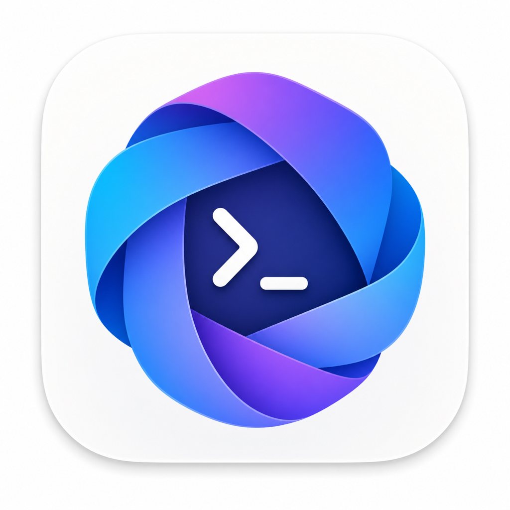
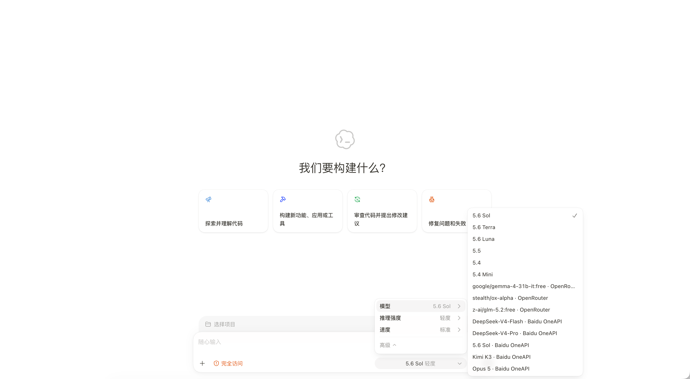
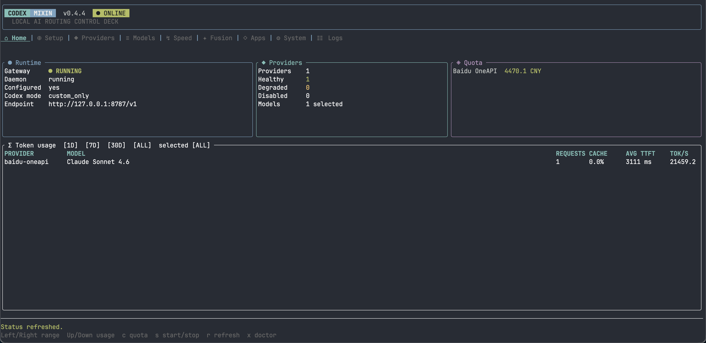
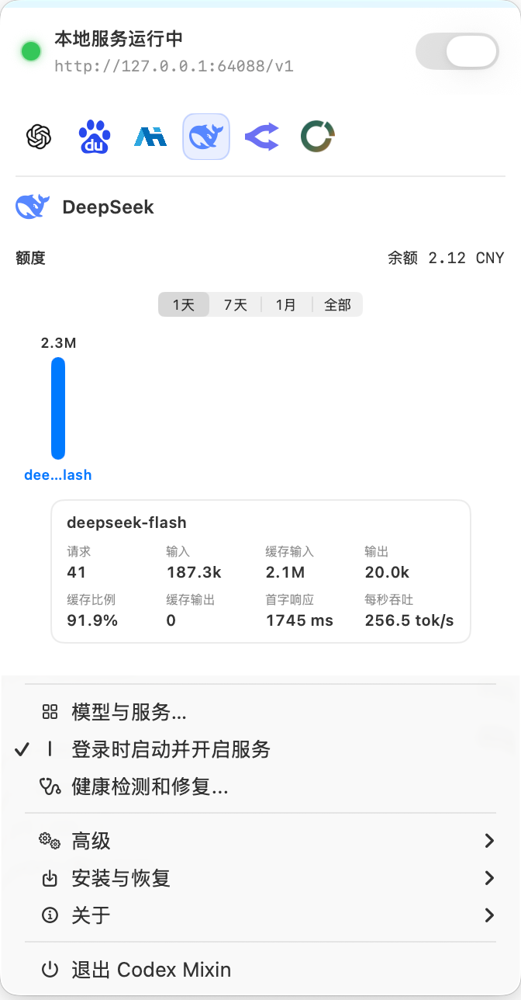
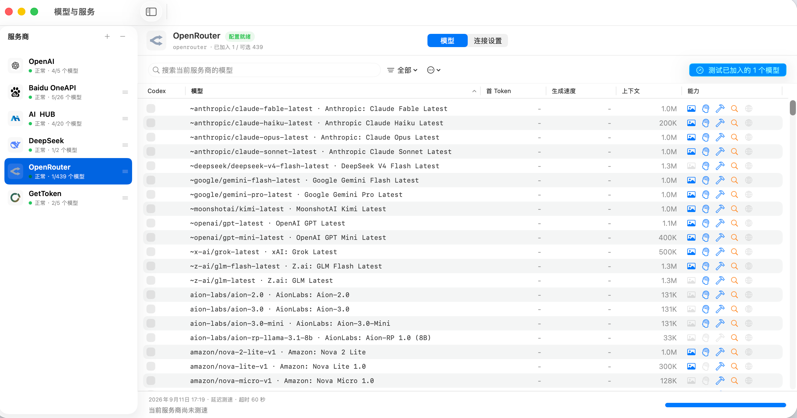
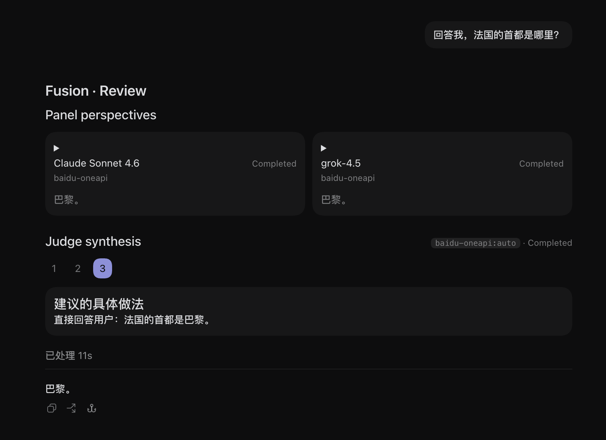
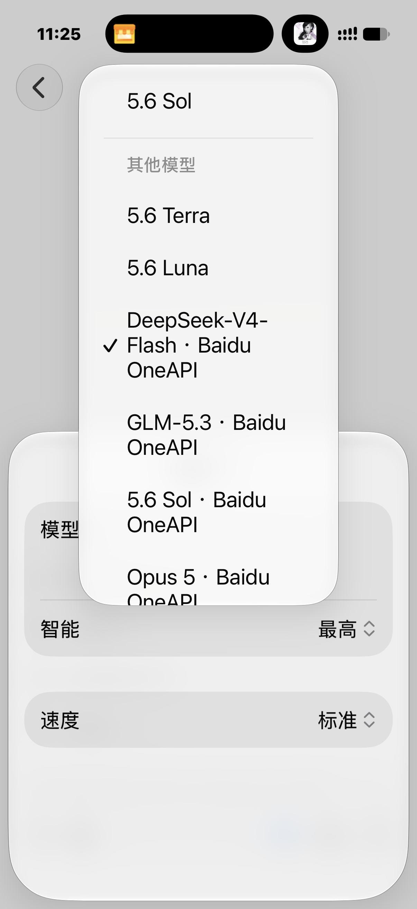

# Codex Mixin

<p align="center">
  
</p>

<p align="center">
  <a href="https://github.com/Edward-lyz/codex-mixin/releases/latest"></a>
  <a href="https://github.com/Edward-lyz/codex-mixin/releases"></a>
  <a href="LICENSE"></a>
</p>

<p align="center">
  <b>Custom providers and official Codex, managed from one local control plane.</b><br>
</p>

<p align="center">
  <a href="#中文">中文</a> ·
  <a href="#english">English</a> ·
  <a href="https://github.com/Edward-lyz/codex-mixin/wiki/Product-Tour">Product tour</a> ·
  <a href="https://github.com/Edward-lyz/codex-mixin/wiki">Wiki</a> ·
  <a href="https://github.com/Edward-lyz/codex-mixin/releases/latest">Download</a> ·
  <a href="https://github.com/Edward-lyz/codex-mixin/issues">Issues</a>
</p>

<table>
  <tr>
    <td width="50%" align="center">
      <a href="docs/assets/APP-model-picker.png"></a><br>
      <sub>macOS · model catalog, capability state, selection and benchmark</sub>
    </td>
    <td width="50%" align="center">
      <a href="docs/assets/CLI-Home.png"></a><br>
      <sub>Terminal · gateway, providers, quota, token usage, TTFT and throughput</sub>
    </td>
  </tr>
  <tr>
    <td width="50%" align="center">
      <a href="docs/assets/APP-MainMenu.png"></a><br>
      <sub>Menu bar · lifecycle, quota, token usage, updates and logs</sub>
    </td>
    <td width="50%" align="center">
      <a href="docs/assets/APP-ProviderModelList.png"></a><br>
      <sub>Models and Services · discovery, capability state and selection</sub>
    </td>
  </tr>
  <tr>
    <td width="50%" align="center">
      <a href="docs/assets/fusion-review.png"></a><br>
      <sub>Fusion · native Panel and Judge review rendered inside Codex</sub>
    </td>
    <td width="50%" align="center">
      <a href="docs/assets/Mobile_Choice.PNG"></a><br>
      <sub>Mobile · choose official or Mixin-managed models for remote tasks</sub>
    </td>
  </tr>
</table>

<p align="center">
  <a href="https://github.com/Edward-lyz/codex-mixin/wiki/Product-Tour"><b>查看包含全部 macOS、TUI、Fusion 和移动端截图的 Product Tour</b></a>
</p>

## 中文

Codex Mixin 是一个跨平台的 Rust 本地网关，提供 Windows 桌面 App、原生 macOS 菜单栏 App 与终端下的全屏 TUI。它把 OpenRouter、DeepSeek、Baidu OneAPI、AWS Bedrock 或其他兼容 OpenAI / Anthropic 协议的模型接入官方 Codex，同时保留官方 ChatGPT/OpenAI 账号路径、GPT 模型、远程控制和 Codex 原生体验。

### 核心能力

- 官方模型与自定义模型共存于 Codex 模型选择器，重名模型自动隔离，历史会话会自动迁移。
- 官方模型清单直接同步 [OpenAI 官方模型列表](https://github.com/openai/codex/blob/main/codex-rs/models-manager/models.json)，每 30 秒检查一次官方模型清单和自定义模型清单，支持缓存复用，模型变更时会弹出系统提示，切换模型快人一步。
- [官方 GPT ECH 访问（实验）](https://github.com/Edward-lyz/codex-mixin/wiki/ECH-GPT-Access)：通过中继DoH 获取地址和 ECH 配置，选择最优 IP 节点，以及固定 Azure IP 访问 OpenAI 端点，避免风控并在网络受限的前提下直接访问 GPT。
- 支持 OpenAI Responses、Chat Completions、Anthropic Messages 等协议互相无损转换。
- 支持全平台使用，并根据平台不同提供不同的 UI 层级。
- 自动完成供应商管理、模型发现、能力探测、上下文配置、测速、额度和 Token 监测。
- 模型融合支持多模型编排，提升整体表现；以及按时间轮转，一个模型名称下，按时间路由至不同模型（适用于波峰-波谷计价用户）
- 配置加密，可导出为 Base64 备份并在另一台机器一键导入，无需繁琐重新配置
- 目前支持的框架有：Codex、Claude Code、DSH、OpenCode 和 Pi 。

### 产品形态

| 组件 | 作用 |
| --- | --- |
| macOS App | 菜单栏状态、Provider 与模型管理、测速、配置备份、更新和修复 |
| Windows App | 系统托盘、Provider 与模型管理、测速、配置备份、客户端接入和修复 |
| TUI | 面向 Linux、SSH 和远端环境的完整终端控制台 |
| CLI | 跨平台 core：稳定子命令、JSON contract 和后台服务管理 |

### 内置 Provider

| Provider | 主要协议 |
| --- | --- |
| Baidu OneAPI | Anthropic Messages / OpenAI Responses |
| OpenRouter | OpenAI Chat Completions |
| DeepSeek | OpenAI Chat Completions |
| OpenCode Go | OpenAI Responses |
| AWS Bedrock | Anthropic Messages |

### 文档

完整安装、配置和排障资料维护在 [GitHub Wiki](https://github.com/Edward-lyz/codex-mixin/wiki)：

- [产品展示](https://github.com/Edward-lyz/codex-mixin/wiki/Product-Tour)
- [安装](https://github.com/Edward-lyz/codex-mixin/wiki/Installation) 与 [快速开始](https://github.com/Edward-lyz/codex-mixin/wiki/Quick-Start)
- [配置备份与恢复](https://github.com/Edward-lyz/codex-mixin/wiki/Configuration-Backup-and-Restore)
- [Provider 与模型](https://github.com/Edward-lyz/codex-mixin/wiki/Providers-and-Models)
- [客户端集成](https://github.com/Edward-lyz/codex-mixin/wiki/Client-Integrations) 与 [Fusion](https://github.com/Edward-lyz/codex-mixin/wiki/Fusion)
- [官方模型清单](https://github.com/Edward-lyz/codex-mixin/wiki/Official-Model-Catalog) 与 [ECH、日志和 TUN](https://github.com/Edward-lyz/codex-mixin/wiki/ECH-GPT-Access)
- [CLI 参考](https://github.com/Edward-lyz/codex-mixin/wiki/CLI-Reference)
- [排障](https://github.com/Edward-lyz/codex-mixin/wiki/Troubleshooting) 与 [常见问题](https://github.com/Edward-lyz/codex-mixin/wiki/FAQ)

## English

Codex Mixin is a cross-platform local gateway built in Rust. It provides a Windows desktop app, a native macOS menu bar app, and a full-screen terminal UI. It connects OpenRouter, DeepSeek, Baidu OneAPI, AWS Bedrock, and other OpenAI- or Anthropic-compatible providers to official Codex while preserving official ChatGPT/OpenAI account access, GPT models, remote control, and the native Codex experience.

### Core features

- Official and custom models share the Codex model picker. Models with the same name are kept separate, and existing conversations migrate automatically.
- Model catalogs sync directly from the [official OpenAI model list](https://github.com/openai/codex/blob/main/codex-rs/models-manager/models.json). Official and custom catalogs are checked every 30 seconds, with cache reuse when supported. System notifications alert you to model changes so you can switch sooner.
- [Experimental ECH access for official GPT](https://github.com/Edward-lyz/codex-mixin/wiki/ECH-GPT-Access): query the relay service's DoH endpoint for addresses and ECH configuration, then connect to official OpenAI endpoints with ECH. Availability depends on the service and network; a fixed Azure exit, avoidance of service risk controls, and access from restricted networks are not guaranteed.
- Convert between OpenAI Responses, Chat Completions, and Anthropic Messages while preserving supported protocol semantics.
- Cross-platform support, with interfaces suited to each platform.
- Automatic provider management, model discovery, capability probing, context configuration, benchmarking, quota monitoring, and token usage tracking.
- Fusion combines multiple models to improve overall results. Time-based rotation routes one model name to different upstream models at different times, which is useful for peak and off-peak pricing.
- Encrypted configuration can be exported as a Base64 backup and imported on another machine without repeating setup.
- Supported clients include Codex, Claude Code, DSH, OpenCode, and Pi.

### Product interfaces

| Component | Purpose |
| --- | --- |
| macOS App | Menu bar status, provider and model management, benchmarking, configuration backups, updates, and repair |
| Windows App | System tray, provider and model management, benchmarking, configuration backups, client integration, and repair |
| TUI | A complete terminal console for Linux, SSH, and remote environments |
| CLI | Shared cross-platform core with stable subcommands, JSON contracts, and background service management |

### Built-in providers

| Provider | Main protocols |
| --- | --- |
| Baidu OneAPI | Anthropic Messages / OpenAI Responses |
| OpenRouter | OpenAI Chat Completions |
| DeepSeek | OpenAI Chat Completions |
| OpenCode Go | OpenAI Responses |
| AWS Bedrock | Anthropic Messages |

### Documentation

Installation, configuration, and troubleshooting guides are maintained in the [GitHub Wiki](https://github.com/Edward-lyz/codex-mixin/wiki):

- [Product Tour](https://github.com/Edward-lyz/codex-mixin/wiki/Product-Tour)
- [Installation](https://github.com/Edward-lyz/codex-mixin/wiki/Installation) and [Quick Start](https://github.com/Edward-lyz/codex-mixin/wiki/Quick-Start)
- [Configuration Backup and Restore](https://github.com/Edward-lyz/codex-mixin/wiki/Configuration-Backup-and-Restore)
- [Providers and Models](https://github.com/Edward-lyz/codex-mixin/wiki/Providers-and-Models)
- [Client Integrations](https://github.com/Edward-lyz/codex-mixin/wiki/Client-Integrations) and [Fusion](https://github.com/Edward-lyz/codex-mixin/wiki/Fusion)
- [Official Model Catalog](https://github.com/Edward-lyz/codex-mixin/wiki/Official-Model-Catalog) and [ECH, Logs, and TUN](https://github.com/Edward-lyz/codex-mixin/wiki/ECH-GPT-Access)
- [CLI Reference](https://github.com/Edward-lyz/codex-mixin/wiki/CLI-Reference)
- [Troubleshooting](https://github.com/Edward-lyz/codex-mixin/wiki/Troubleshooting) and [FAQ](https://github.com/Edward-lyz/codex-mixin/wiki/FAQ)

## License

See [LICENSE](LICENSE) and [NOTICE](NOTICE).

### Claude Desktop

Claude Code's desktop entry point is the Code tab in the official
[Claude Desktop app](https://claude.com/download). To route its local sessions
through Codex Mixin, select models in your providers, keep the gateway running,
and run:

```sh
codex-mixin connect claude-desktop
codex-mixin connect claude-desktop --status --json
# Restore the deployment mode and profile that preceded integration:
codex-mixin connect remove claude-desktop
```

The connect command starts or restarts the managed gateway after committing
the profile, so the serving process includes the Desktop routes and client key.
Fully quit and reopen Claude Desktop after connecting, restoring, or changing
selected models. The macOS **Install and Restore** menu, Windows install page,
and TUI **Integrations** page (`d` / `D`) expose the same commands. Desktop and
the Claude Code CLI have separate integrations; `connect claude` still manages
only Claude Code CLI settings.

The Desktop profile is registered in `Claude-3p/configLibrary/_meta.json` and
uses the gateway's `/claude-desktop` prefix with a separate client key. Every
selected catalog model receives a stable `claude-sonnet-mixin-*` route and a
label containing its real model and provider name. The Sonnet prefix is a
Desktop-compatible route family, not a claim about the upstream model.
Anthropic Messages, OpenAI Chat Completions, and OpenAI Responses use the
existing protocol conversion. Models with at least one million context tokens
receive `supports1m`; Desktop accepts at most 200 selected models.

Default configuration roots are `~/Library/Application Support` on macOS,
`%LOCALAPPDATA%` on Windows, and `$XDG_CONFIG_HOME` (or `~/.config`) on Linux.
Use `--config-root <parent-of-Claude-and-Claude-3p>` on either connect or remove
for a custom installation. Integration saves an owner-only backup before
switching deployment modes; restore removes managed fields while retaining
unrelated settings and user edits. Model/key synchronization refreshes the
Mixin profile without changing the profile selected manually in Desktop.
This integration targets local Desktop inference; cloud sessions and
Anthropic account services are outside its routing scope.

The Desktop profile format follows the
[CC Switch implementation](https://github.com/farion1231/cc-switch/blob/main/src-tauri/src/claude_desktop_config.rs)
and was checked against Claude Desktop 2.31226.1 on macOS.
